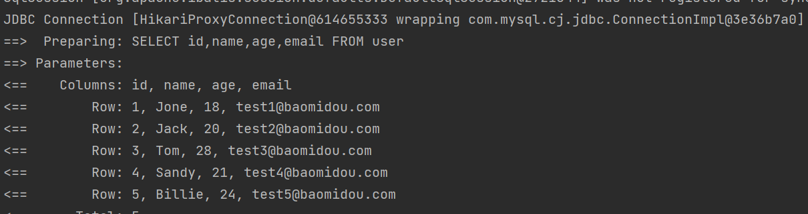
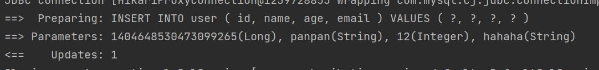
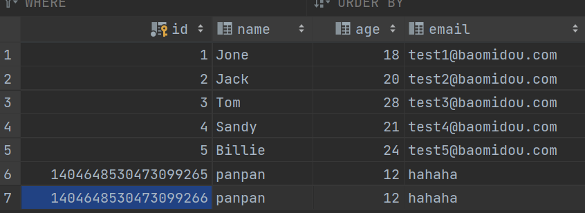
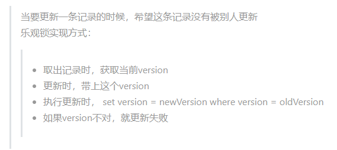
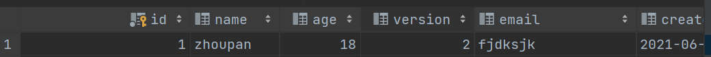
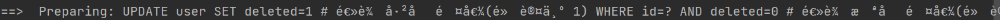
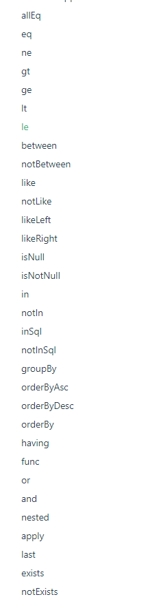

# MyBatisPlus概述

mybatisPlus可以节省我们大量工作时间，所有的CRUD代码它都可以自动化完成。简化MyBatis！

- JPA
- tk-mapper
- MyBatisPlus

> ## 特性：

- **无侵入**：只做增强不做改变，引入它不会对现有工程产生影响，如丝般顺滑
- **损耗小**：启动即会自动注入基本 CURD，性能基本无损耗，直接面向对象操作（BaseMapper）
- **强大的 CRUD 操作**：内置通用 Mapper、通用 Service，仅仅通过少量配置即可实现单表大部分 CRUD 操作，更有强大的条件构造器，满足各类使用需求（以后简单的CRUD，自动帮你生成）
- **支持 Lambda 形式调用**：通过 Lambda 表达式，方便的编写各类查询条件，无需再担心字段写错
- **支持主键自动生成**：支持多达 4 种主键策略（内含分布式唯一 ID 生成器 - Sequence），可自由配置，完美解决主键问题
- **支持 ActiveRecord 模式**：支持 ActiveRecord 形式调用，实体类只需继承 Model 类即可进行强大的 CRUD 操作
- **支持自定义全局通用操作**：支持全局通用方法注入（ Write once, use anywhere ）
- **内置代码生成器**：采用代码或者 Maven 插件可快速生成 Mapper 、 Model 、 Service 、 Controller 层代码，支持模板引擎，更有超多自定义配置等您来使用（自动生成代码）
- **内置分页插件**：基于 MyBatis 物理分页，开发者无需关心具体操作，配置好插件之后，写分页等同于普通 List 查询
- **分页插件支持多种数据库**：支持 MySQL、MariaDB、Oracle、DB2、H2、HSQL、SQLite、Postgre、SQLServer 等多种数据库
- **内置性能分析插件**：可输出 Sql 语句以及其执行时间，建议开发测试时启用该功能，能快速揪出慢查询
- **内置全局拦截插件**：提供全表 delete 、 update 操作智能分析阻断，也可自定义拦截规则，预防误操作

# 快速入门

1、创建数据库mybatis_plus

2、创建user表

```sql
DROP TABLE IF EXISTS user;

CREATE TABLE user
(
	id BIGINT(20) NOT NULL COMMENT '主键ID',
	name VARCHAR(30) NULL DEFAULT NULL COMMENT '姓名',
	age INT(11) NULL DEFAULT NULL COMMENT '年龄',
	email VARCHAR(50) NULL DEFAULT NULL COMMENT '邮箱',
	PRIMARY KEY (id)
);
-- 真实开发中，version(乐观锁)、deleted（逻辑删除）、gmt_create、gmt_modified在创建表中是必须拥有的
INSERT INTO user (id, name, age, email) VALUES
(1, 'Jone', 18, 'test1@baomidou.com'),
(2, 'Jack', 20, 'test2@baomidou.com'),
(3, 'Tom', 28, 'test3@baomidou.com'),
(4, 'Sandy', 21, 'test4@baomidou.com'),
(5, 'Billie', 24, 'test5@baomidou.com');
```

3、编写项目，使用springboot新建项目。

4、导入依赖

```xml
<!--        mybatisplus,这个是自己开发的，并非官方-->
        <dependency>
            <groupId>com.baomidou</groupId>
            <artifactId>mybatis-plus-boot-starter</artifactId>
            <version>3.0.5</version>
        </dependency>
<!--        数据库驱动-->
        <dependency>
            <groupId>mysql</groupId>
            <artifactId>mysql-connector-java</artifactId>
            <version>8.0.23</version>
        </dependency>
        <dependency>
            <groupId>org.projectlombok</groupId>
            <artifactId>lombok</artifactId>
            <version>1.18.18</version>
        </dependency>
```

尽量不要同时导入MyBatis和MyBatisPlus依赖！

5、编写配置文件

```sql
#mysql5 和 mysql8的驱动不同，且8要增加时区的配置
spring.datasource.driver-class-name=com.mysql.cj.jdbc.Driver
spring.datasource.url=jdbc:mysql://localhost:3306/mybatis_plus?useSSL=true&useUnicode=true&characterEncoding=utf-8&serverTimezone=Asia/Shanghai
spring.datasource.username=root
spring.datasource.password=123456
```

//6、MyBatis方式:pojo-dao(需要连接mybatis，配置mapper.xml文件)-service-controller

6、使用了MyBatisPlus：

- pojo

  ```java
  @Data
  @AllArgsConstructor
  @NoArgsConstructor
  public class User {
      private Long id;
      private String name;
      private Integer age;
      private String email;
  }
  ```

  

- mapper接口

  ```java
  //再对应的Mapper上面集成基本的类BaseMapper
  @Repository//代表持久层
  public interface UserMapper extends BaseMapper<User> {
      //所有的CRUD操作都已经完成了，不需要再写xml文件
  }
  ```

  User要传入BaseMapper的泛型中去。

  另外：需要再主启动类上增加 `@MapperScan("com.kuang.mapper") 扫描mapper`

- 测试

  ```java
  @Autowired
      private UserMapper userMapper;
      @Test
      void contextLoads() {
          List<User> users = userMapper.selectList(null);
          users.forEach(System.out::println);
      }
  ```

  > 思考：sql怎么来的？方法哪里来的？都是MyBatisPlus

# 配置日志

我们所有的sql现在是不可见的，我们希望知道它是怎么执行的，所以我们必须要看日志！

开发过程可以开启日志，上线之后就关闭它。

配置文件增加配置：

```properties
#配置日志
mybatis-plus.configuration.log-impl=org.apache.ibatis.logging.stdout.StdOutImpl
```

运行结果如下：



可以看到出现了sql语句！

# CRUD扩展

## Insert

测试插入代码：

```java
User user = new User();
        user.setAge(12);
        user.setName("panpan");
        user.setEmail("hahaha");
        userMapper.insert(user);
```

结果



可以看到自动帮我们生成了一个id！

>数据库插入的id的默认值为：全局唯一id

### 主键生成策略

uuid、自增id、雪花算法、redis、zookeeper！


>默认ID_WORKER 全局唯一ID

分布式系统唯一id生成方案：https://www.cnblogs.com/haoxinyue/p/5208136.html

雪花算法：

snowflake是Twitter开源的分布式ID生成算法，结果是一个long型的ID。其核心思想是：使用41bit作为毫秒数，10bit作为机器的ID（5个bit是数据中心，5个bit的机器ID），12bit作为毫秒内的流水号（意味着每个节点在每毫秒可以产生 4096 个 ID），最后还有一个符号位，永远是0。可以几乎保证全球唯一！


> 主键自增

我们需要配置主键自增：

1. 实体类字段上 `@TableId(type= IdType.AUTO)`

2. 数据库字段一定要是自增的！

   修改后运行插入代码，可以看到数据插入到数据库，并且id自增！



> 其余的源码解释

```java
public enum IdType {
    AUTO(0),//数据库自增，要把数据库表字段设置为自增
    NONE(1),//未设置主键
    INPUT(2),//手动输入
    ID_WORKER(3),//默认的全局唯一id
    UUID(4),//全局唯一id  uuid
    ID_WORKER_STR(5);//ID_WORKER的字符串表示
}
```


## Update

```java
@Test
    public void testUpdate(){
        User user = new User();
        //通过条件动态拼接sql
        user.setId(5L);
        user.setName("panpan");
        //注意参数是个user对象，不是一个id！
        userMapper.updateById(user);
    }
```

运行前后数据对比：


### 自动填充

创建时间，修改时间。。。这些个操作一遍都是自动化完成的，我们不希望手动更新！

所有的数据库表：gmt_create、gmt_modified几乎所有的表都要配置上，需要自动化！

> 方式一：数据库级别（工作中不允许你改数据库）

1、在表中新增create_time, update_time字段, update_time字段需要勾选更新选项

2、在此测试插入方法，我们需要先把实体类同步

```java
private Date createTime;
private Date updateTime;
```


> 方式二：代码级别

1、删除(复原)我们在方式一中设置的字段默认值和更新选项

2、实体类字段属性上增加注解！

```java
    @TableField(fill= FieldFill.INSERT)//插入时调用handler
    private Date createTime;
    @TableField(fill= FieldFill.INSERT_UPDATE)//插入和更新时调用handler
    private Date updateTime;
```

3、编写处理器来处理这个注解

```java
@Slf4j
@Component//一定不要忘记把处理器加到IOC容器中去
public class MyHandler implements MetaObjectHandler {
    //插入时的填充策略
    @Override
    public void insertFill(MetaObject metaObject) {
        log.info("start insert fill...");
        this.setFieldValByName("createTime",new Date(),metaObject);
        this.setFieldValByName("updateTime",new Date(),metaObject);
    }
    //更新时的填充策略
    @Override
    public void updateFill(MetaObject metaObject) {
        log.info("start update fill");
        this.setFieldValByName("updateTime",new Date(),metaObject);
    }
}

```

4、测试插入，更新。


### 乐观锁

面试进场问到乐观锁和悲观锁。

> 乐观锁：总是人为不会出现问题，无论干什么都不去上锁！如果出现了问题，再次更新值测试。一般使用version、newversion字段，每次更新携带版本号，来判断数据有没有更新。
>
> 悲观锁：总是认为总会出现问题，无论干什么都会上锁！再去操作。



测试：

1、数据库表user加version字段，**默认值为1**

2、实体类user加对应字段

```java
@Version//乐观锁version注解
private Integer version;
```

3、注册组件

新建config包和MyBatisPlusConfig文件，相关的MybatisPlus配置可以在这个配置类中配置，包括`@MapperScan("com.kuang.mapper")`

```java
@MapperScan("com.kuang.mapper")//扫描包
@EnableTransactionManagement//事务的注解
@Configuration//配置类
public class MyBatisPlusConfig {
    //注册乐观锁插件
    @Bean
    public OptimisticLockerInterceptor optimisticLockerInterceptor() {
        return new OptimisticLockerInterceptor();
    }
}
```

注意，@MapperScan原本是在主启动类上，可以把他移到这个配置类中，这样可以减少主启动类上的注解数量，方便查看。

4、测试



可以看到version字段变成了2

## select

```java
        //单个查询
        User user = userMapper.selectById(1L);
        System.out.println(user);
        //批量查询
        List<User> users = userMapper.selectBatchIds(Arrays.asList(1, 2, 3));
        users.forEach(System.out::println);
        //条件查询之一，使用map
        HashMap<String, Object> map = new HashMap<>();
        map.put("name","panpan");
        userMapper.selectByMap(map);
```

### 分页查询

1、原始的limit进行分页

2、pageHelper第三方插件

3、MybatisPlus也内置了分页插件！

使用：在之前的`MyBatisPlusConfig.java`配置类中增加分页拦截器！

```java
    //分页插件
    @Bean
    public PaginationInterceptor paginationInterceptor() {
        return new PaginationInterceptor();
    }
```

测试：

```java
        //参数一：当前页
        //参数二：页面大小
        Page<User> page = new Page<>(1,5);
        userMapper.selectPage(page, null);
        page.getRecords().forEach(System.out::println);
```

## delete

```java
        //id删除
        userMapper.deleteById(1404648530473099267L);
        //id批量删除
        userMapper.deleteBatchIds(Arrays.asList(1404648530473099266L,1404648530473099265L));
        //条件删除
        HashMap<String, Object> map = new HashMap<>();
        map.put("name","panpan");
        userMapper.deleteByMap(map);
```

### 逻辑删除

> 物理删除：从数据库中直接删除
>
> 逻辑删除：在数据库中没有被溢出，而是通过一个变量让它失效！

比如管理员可以查看被删除的记录！防止数据的丢失，类似于回收站。

测试：

1、在数据表中增加deleted字段，**默认为0**

2、修改实体类User

```java
@TableLogic//逻辑删除注解
private Integer deleted;
```

3、配置文件增加配置

```properties
mybatis-plus.global-config.db-config.logic-delete-value= 1 # 逻辑已删除值(默认为 1)
mybatis-plus.global-config.db-config.logic-not-delete-value= 0 # 逻辑未删除值(默认为 0)
```

4、配置类增加逻辑删除配置

```java
    //逻辑删除
    @Bean
    public ISqlInjector sqlInjector(){
        return new LogicSqlInjector();
    }
```


5、测试

这里记录一个坑爹的bug：如果按照上面的5步来的话，自动生成的逻辑删除sql语句如下所示：



没错，居然出现了乱码！这个的根源在于第三步的配置文件，这个配置是我们从官网上直接拷贝过来的，每一行都有对应的注释，而这些注释再配置文件中显示是绿的，就是说这些已经不再是注释，而是我们配置的属性值了！

```properties
# 逻辑已删除值(默认为 1)
mybatis-plus.global-config.db-config.logic-delete-value= 1
# 逻辑未删除值(默认为 0)
mybatis-plus.global-config.db-config.logic-not-delete-value= 0
```

改成上面这样就可以了。

## 性能分析插件

在平时的开发中，会员到一些**慢sql**。怎么处理这些慢sql呢？

- 测试
- druid
- 性能分析插件

MybatisPlus自带有性能分析插件，如果超过这个时间就停止运行。

1、导入插件

2、测试使用。

新版中已经被移除，推荐使用外部的性能分析工具。

## 条件构造器

十分重要，写一些复杂的sql，就可以用这些warpper来替代。

> 

```java
@Test
    void contextLoads() {
        //查询name不为空的用户，并且邮箱不为空，年龄大于等于19
        QueryWrapper<User> wrapper = new QueryWrapper<>();
        wrapper.isNotNull("name")
                .isNotNull("email")
                .ge("age",19);
        userMapper.selectList(wrapper).forEach(System.out::println);
    }
```

```java
@Test
    void test2() {
        //查询name不为空的用户，并且邮箱不为空，年龄大于等于12
        QueryWrapper<User> wrapper = new QueryWrapper<>();
        wrapper.eq("name","panpan");
        //查询一个数据。要查询多个数据时使用LIst或者Map
        User user = userMapper.selectOne(wrapper);
        System.out.println(user);
    }
```

```java
@Test
    void test3() {
        //查询20岁到30岁之间的用户数
        QueryWrapper<User> wrapper = new QueryWrapper<>();
        wrapper.between("age",20,30);
        Integer i = userMapper.selectCount(wrapper);//查询结果数
        System.out.println(i);
    }
```

```java
@Test
    void test4(){
        //模糊查询，查询名字中不包含z的用户，邮箱中以t开头
        QueryWrapper<User> wrapper = new QueryWrapper<>();
        wrapper.notLike("name","z")
                .likeRight("email","t");
        List<Map<String, Object>> maps = userMapper.selectMaps(wrapper);
        maps.forEach(System.out::println);
    }
```

```java
void test5(){
        QueryWrapper<User> wrapper = new QueryWrapper<>();
        //id在子查询中查出来,内敛查询
        wrapper.inSql("id","select id from user where id<3");
        List<Object> objects = userMapper.selectObjs(wrapper);
        objects.forEach(System.out::println);
    }
```

```java
@Test
    void test6(){
        QueryWrapper<User> wrapper = new QueryWrapper<>();
        //通过id进行排序
        wrapper.orderByDesc("id");
        List<User> users = userMapper.selectList(wrapper);
        users.forEach(System.out::println);
    }
```

还有其他很多条件构造器，可以查看官网。

## 代码自动生成器

AutoGenerator可以快速生成Entity、Mapper、Mapper XML、Service、Controller等各个模块的代码！

1、建立各种数据库表（数据库要规范，包含乐观锁，逻辑删除，插入和更新记录字段）

2、项目导入MybatisPlus插件

```xml
<dependency>
    <groupId>com.baomidou</groupId>
    <artifactId>mybatis-plus-generator</artifactId>
    <version>3.4.1</version>
</dependency>
```

默认的模板引擎是Velocity，如果需要其他模板引擎需要导入依赖，如FreeMarker：

```xml
<dependency>
    <groupId>org.freemarker</groupId>
    <artifactId>freemarker</artifactId>
    <version>2.3.31</version>
</dependency>
```

然后在第三步中增加模板引擎的设置。

3、在项目中编写下面代码并运行（不同项目的设置信息可能有变化，需要修改）。

```java
import com.baomidou.mybatisplus.annotation.DbType;
import com.baomidou.mybatisplus.annotation.FieldFill;
import com.baomidou.mybatisplus.annotation.IdType;
import com.baomidou.mybatisplus.annotation.TableField;
import com.baomidou.mybatisplus.generator.AutoGenerator;
import com.baomidou.mybatisplus.generator.config.DataSourceConfig;
import com.baomidou.mybatisplus.generator.config.GlobalConfig;
import com.baomidou.mybatisplus.generator.config.PackageConfig;
import com.baomidou.mybatisplus.generator.config.StrategyConfig;
import com.baomidou.mybatisplus.generator.config.po.TableFill;
import com.baomidou.mybatisplus.generator.config.rules.DateType;
import com.baomidou.mybatisplus.generator.config.rules.NamingStrategy;
import java.util.ArrayList;
// 代码自动生成器
public class dd {
    public static void main(String[] args) {
        // 需要构建一个 代码自动生成器 对象
        AutoGenerator mpg = new AutoGenerator();
        // 配置策略
        // 1、全局配置
        GlobalConfig gc = new GlobalConfig();
        String projectPath = System.getProperty("user.dir");
        gc.setOutputDir(projectPath+"/src/main/java");
        gc.setAuthor("狂神说");
        gc.setOpen(false);
        gc.setFileOverride(false); // 是否覆盖
        gc.setServiceName("%sService"); // 去Service的I前缀
        gc.setIdType(IdType.ID_WORKER);
        gc.setDateType(DateType.ONLY_DATE);
        gc.setSwagger2(true);
        mpg.setGlobalConfig(gc);

        //2、设置数据源
        DataSourceConfig dsc = new DataSourceConfig();
        dsc.setUrl("jdbc:mysql://localhost:3306/kuang_community? useSSL=false&useUnicode=true&characterEncoding=utf-8&serverTimezone=GMT%2B8");
        dsc.setDriverName("com.mysql.cj.jdbc.Driver");
        dsc.setUsername("root");
        dsc.setPassword("123456");
        dsc.setDbType(DbType.MYSQL);
        mpg.setDataSource(dsc);

        //3、包的配置
        PackageConfig pc = new PackageConfig();
        pc.setModuleName("blog");
        pc.setParent("com.kuang");
        pc.setEntity("entity");
        pc.setMapper("mapper");
        pc.setService("service");
        pc.setController("controller");
        mpg.setPackageInfo(pc);

        //4、策略配置
        StrategyConfig strategy = new StrategyConfig();
        strategy.setInclude("blog_tags","course","links","sys_settings","user_record"," user_say"); // 设置要映射的表名
        strategy.setNaming(NamingStrategy.underline_to_camel);
        strategy.setColumnNaming(NamingStrategy.underline_to_camel);
        strategy.setEntityLombokModel(true); // 自动lombok；
        strategy.setLogicDeleteFieldName("deleted");
        // 自动填充配置
        TableFill gmtCreate = new TableFill("gmt_create", FieldFill.INSERT);
        TableFill gmtModified = new TableFill("gmt_modified", FieldFill.INSERT_UPDATE);
        ArrayList<TableFill> tableFills = new ArrayList<>();
        tableFills.add(gmtCreate);
        tableFills.add(gmtModified);
        strategy.setTableFillList(tableFills);
        // 乐观锁
        strategy.setVersionFieldName("version");
        strategy.setRestControllerStyle(true);
        strategy.setControllerMappingHyphenStyle(true); //localhost:8080/hello_id_2
        mpg.setStrategy(strategy);
        
        mpg.execute(); //执行
    }
}
```

