> 网站架构演进:
>
> - 单机（加索引优化等）
>
> - Memcached(缓存) + Mysql + 垂直拆分（读写分离）：数据库访问的百分之80都在读操作，可以通过缓存来解决读的问题。
>
>   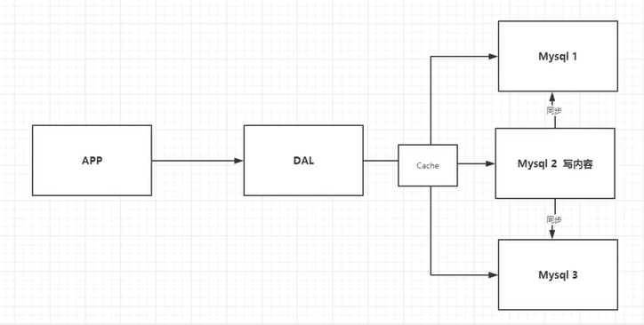
>
> - 分库分表+水平拆分+MySQL集群
>
> - 如今的架构
>
>   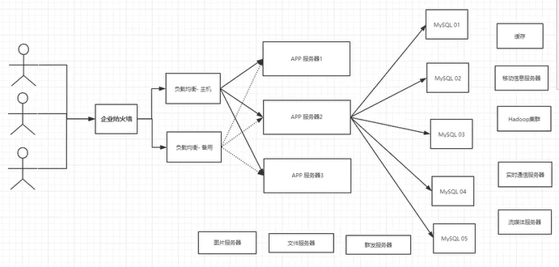

不同数据类型的一般存储方法:

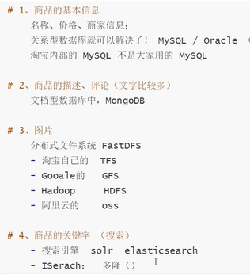

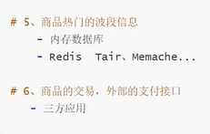

# Redis入门

## 概述

> Redis能干吗？
>
> - 内存存储、持久化，内存中断电即失，所以持久化很重要（rdb，aof）
> - 效率高，可以用于高速缓存
> - 发布订阅系统
> - 地图信息分析
> - 计数器（浏览量等）

> 特性：
>
> - 持久化
> - 多样的数据结构
> - 集群
> - 事务

## 测试性能

redis-benchmark是一个官方自带的性能、压力测试工具。在redis安装目录中有。

命令参数如下：

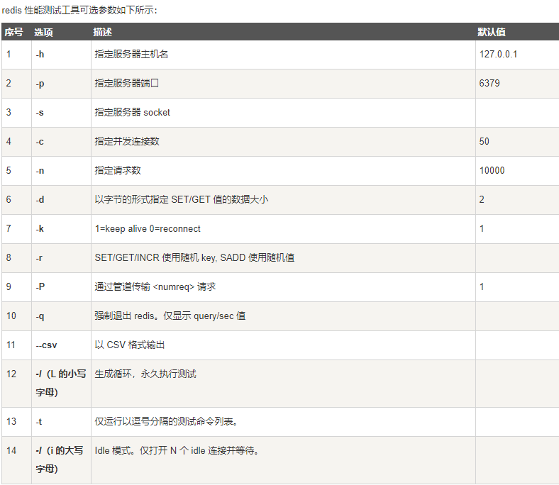

## 基础知识

redis默认有16个数据库（配置文件中可以修改），默认使用的是第0个数据库

> **典型命令**：

- `select 3`：切换到3号数据库

- `set key name`: 设置键值对

- `get key`:  获取key对应的value

- `keys *` :查看数据库所有的key

- `flushdb`：清空当前数据库

- `FLUSHALL`：清空所有数据库

- `exists key`:  是否存在key，存在就返回1

- `move key  1`： 把key移到数据库1

- `expire key 10`:  设置key的过期时间为10s

- `ttl  key`：查看key的剩余存活时间

- `type key`:  查看key的类型

  这些所有的命令需要记住，使用java的jedis操作数据时就是使用这些命令的。

  不熟的命令可以在官网查看！

> redis是单线程的！

Redis是基于内存操作，CPU不是Redis性能瓶颈，Redis的瓶颈是根据机器的内存和网络带宽，既然可以使用单线程来实现，就是用单线程了。Redis是C语言写的，100000+的QPS，完全不比Memacha差。

端口号是6379，粉丝效应


> 单线程为什么还这么快？

- 只涉及内存
- 100000+QPS足以应付瞬时大量查询操作。
- 多线程存在上下文切换操作

但是6.0版本以上就是多线程的了。

# 数据类型

## String

- `APPEND key value`:  给key对应的val加上value，如果当前key不存在，那么就相当于set命令

- `STRLEN key`:  获得key 对应的value长度

- 

- `incr key`： key对应的value自增1

- `decr key`： key对应的value自减1

- `INCRBY key  10`： 自增10；

- `DECRBY  key  10`:   自减10；

- 

- `GETRANGE key 0  3`: 截取下标0到3的字串；若3为-1，那么就是所有子串；

- `SETRANGE key 1 xx`:把位置1开始的字符串替换成xx

- 

- `setex key 30 value`:  （set with expire）添加这个键值对，并且过期时间为30s

- `setnx key value`:  (set if not exist)  key存在则不设置，不存在才保存键值对。（**用来实现分布式锁**！）

- 

- `mset k1 v1 k2 v2 k3 v3`:  批量设置键值对

- `mget k1 k2 k3`：  批量获取键值对

- `msetnx k1 v1 k4 v4`:  是一个原子性操作！只有k1和k4都不存在时才成功！

- 

- `set user:1 {name:panpan,age:18}`:  设置一个user:1对象，值为json字符来保存一个**对象**

- `set user:1:name panpan和set user:1:age 18`:  这种方法也可以存一个对象。

- 

- `getset key newvalue`：先获取key对应的oldvalue，再设置为新值newvalue

  

> String类型的使用场景：value除了是字符串，还可以是数字：

- **计数器**
- **统计多单位的数量**
- **粉丝数**
- **对象缓存存储**

## List

列表。可以用来当**栈、队列、阻塞队列、消息队列**使用。

- `LPUSH list one`:  列表list存入one，头插法
- `RPUSH list one`:  尾插法
- `LRANGE list 0  3`：获取列表list 0到3的值；3为-1的话就是所有的值
- `LPOP list`:  移除头部的元素
- `RPOP list`：移除最后的元素
- `lindex list  1`:  获取list中下标为1的值
- `Llen list`：获取list的长度
- `lrem list 1 v1`:  移除list集合中指定个数的value，精确匹配。
- `ltrim list 1 2`: 通过下表截取列表。原列表被修改了
- `rpoplpush  list list1`:  从list移出最后一个元素并插入list1的头部
- `lset list 0 newvalue`:  把list的0号元素设置为newvalue；不存在元素就会报错
- `linsert list before/after value newvalue`:  再value的前面/后面插入newvalue

> 实际上，它是一个双向链表，可以使用头插法和尾插法
>
> 如果key不存在，新增链表
>
> 如果key存在，新增内容
>
> 如果移除了所有值，空链表，也代表不存在

**消息排队、消息队列（Lpush Rpop）、栈（Lpush，Lpop）**

## Set

set中元素不能重复，元素无序

- `sadd set1 v1`:  set1中添加元素v1
- `smembers set1`:  查询set1中所有的元素
- `sismember set1 v1`:  查询v1是不是set1的元素
- `scard set1`:  获取set1的元素个数
- `srem set1 v1`:  移除set1中的v1元素
- `srandmember set1`:  随机抽选出一个元素
- `spop set1`:  随机移除一个元素
- `smove set1 set2 v1`:  把set2中的v1移除到set2中
- 
- `sdiff set1 set2`: set1与set2的差集
- `sinter set1 set2`:  set1和set2的交集
- `sunion set1 set2`:  交集

**用户粉丝放到集合中**

**共同关注（交集），二度好友（好友推荐）**

## Hash

Map集合，key-map，值是一个map集合，本质和string没有太大区别，还是一个简单的key-value

- `hset myhash field1 v1 field2 v2 field3 v3`: 设置哈希表myhash的键值对为后面这些。
- `hget myhash field1`:  获取一个字段值
- `hgetall myhash`:  获取所有的数据
- `hdel myhash field1`:  删除field1字段
- `hlen myhash`:  获取数据长度数
- `hexists myhash field1`: 字段field1是否存在
- `hkeys myhash`:  获取所有字段
- `hvalues myhash`:  获取所有值
- `hincrby、hsetnx、hsetex`

**hash通常用来存储经常变动的信息，更加适合对象的存储（如用户信息），String类型更适合字符串。**

## Zset

再set的基础上，增加了一个值

- `zadd、zrange、zrangebyscore、zrevrange、zrem、zcard、zcount`

具体使用时，查查官方API文档

**应用思路：**

**1、set,排序，，存储班级成绩表，工资表排序**

**2、普通消息带1，重要消息带2，带权重进行判断！**

**3、排行榜实现，取topN测试**

# 三种特殊数据类型

## geospatial地理位置

朋友的定位，附近的人，打车距离计算？

只有6个命令

> `geoadd`  添加地理信息

```shell
#geoadd 添加地理位置（经纬度）
#一般会下载城市数据，直接通过java程序一次性导入
geo china-city 纬度值 经度值 名称
```

> `geopos`   获得指定名称的纬度和经度

```shell
geopos china-city 名称
```

> `geodist`   获得两个位置之间的距离

```shell
geodist china-city 名称1 名称2 单位
#所有的数据应该录入china-city中去
```

单位：

- m表示米
- km表示千米
- mi表示英里
- ft表示英尺

>`georadius`  以给定的经纬度为中心，找出某一半径的元素

我附近的人？（获得所有附近的人的定位）通过半径来查询

```shell
georadius china-city 纬度 经度 距离 单位 withdist(显示距离) withcoord(显示定位信息) count 数量(查找数据量)
```

> `georadiusbymember`   找出位于指定元素周围的元素

```shell
georadiusbymember china-city 名称 距离 单位
```

> `geohash`   返回一个或多个位置元素的hash表示

```shell
geohash china-city beijing    #结果返回一个hash字符串，就是把经纬度转换成hash字符串
```

  `geo`的底层就是`zset`，所以可以用`zset`命令来操作`geo`


## Hyperloglog

基数：两个集合不重复的元素数量

比如**存放网页的UV**（一个人访问一个网站多次，但是还是算作一次访问量），传统做法时把浏览过的用户的id放入集合中，这样会造成大量内存的占用。我们的目的是技术，而不是保存用户id。使用Hyperloglog就可以解决上面的冲突。

> 测试使用

- `pfadd mykey a b c d e f g i j`: 创建第一组元素mykey
- `pfcount mykey`:  统计mykey中基数数量
- `pfmerge mykey3 mykey mykey2`: 合并mykey和mykey2到mykey3

如果允许容错，那么一定可以使用Hyperloglog。内存固定，只需要12KB内存

如果不允许容错，那么就是用set。

## Bitmaps

> 位存储

统计用户信息，活跃或不活跃，登录或未登录，打卡或未打卡。。。**只有两个状态的，都可以使用Bitmaps**

```shell
#例子，用户打卡记录，0表示未打卡，1表示打卡
setbit card 0 1   #设置周一打卡
setbit card 1 0   #设置周二未打卡
。。。
getbit card 3    #查看周四是否打卡
bitcount sign    #查看打卡数量
```

# 事务

## Mysql事务回顾

MYSQL的ACID：

- 原子性：A给B转账，A账户扣款和B账户到账要同时成功，其一失败就回滚。
- 一致性：A给B转账，转帐前AB总存款1000，转账后AB总存款还是1000
- 隔离性：AC给B同时转账，两个事务不能相互影响
- 持久性：A给B转账后，即使数据库故障，数据仍然不会丢失。

脏读、幻读、不可重复读：

- 脏读（读取了未提交的新事务，之后事务回滚了）：A给B转账100万，A还未提交，B取到到了A给B的转账，之后A回滚事务，B又成穷光蛋了，B就脏读了（解决：禁止读取未提交的事务）
- 不可重复读(读取了提交的新事务，指更新操作)：B一次事务中有两次查询，第一次查到有100万，第二次查询之前被A更新了数据为0并提交事务，B第二次查询账户余额为0了。（解决：一个事务在读的时候，禁止任何更新操作）
- 幻读（读取了提交的新事务，指增删操作）：B多次读取，A途中增删并提交事务，导致B读取的数据不一致。（解决：上表记锁时，禁止任何操作的并发）

幻读和不可重复读的区别：不可重复是针对记录的update操作，只要在记录上加写锁，就可避免；幻读是对记录的insert操作，

  要禁止幻读必须加上**全局的写锁**(比如在表上加写锁)

4个隔离级别：

- 未提交读：写操作加写锁，读操作不加锁
- 提交读：写操作加写锁（**不是整个事务加锁**），读操作加读锁，写操作的事务提交后才可继续读操作，**避免了脏读**
- 可重复读：读操作**加锁到事务结束**，其他事务的操作只能等到事务结束之后，**避免了不可重复读并且这是大部分数据库的默认隔离级别**。
- 序列化：对表级读写加锁至事务结束，**可以禁止幻读**

## Redis事务

Redis事务本质：一组命令的集合！一个事务中的所有命令都会被序列化，在事务执行过程中，会按照顺序执行。所有的命令在事务中，并没有直接执行，而是发起执行命令时才会执行。

**Redis单条命令时保证原子性的，但是Redis事务是不保证原子性的！**

一次性，顺序性，排他性

> redis的事务：

- 事务开启(multi)
- 命令入队(各种命令。。。)
- 执行事务（exec）

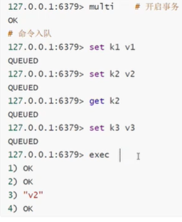

> 放弃事务：discard

> 运行时其中一条命令异常，其他命令是可以正常执行的，错误命令抛出异常。

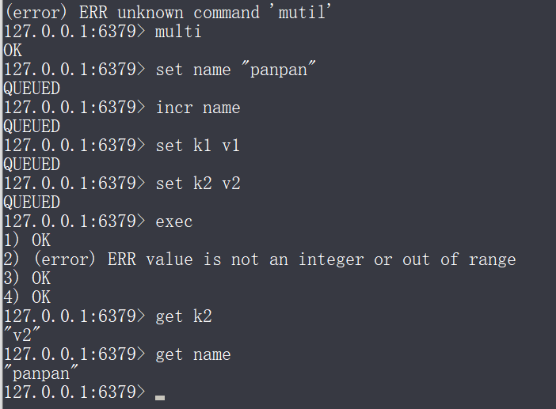

上图中的事务中，incr命令只能对数字自增，导致运行时异常，但是仍然其他命令成功运行了。

## 实现乐观锁

> 监视!  Watch

watch可以当作redis的乐观锁操作。

`set money 100`

`watch money`:  这样就监视了money了，当其他线程修改了这个值，本线程中未执行的事务就会执行失败。要在multi之前watch

`unwatch`：解锁

# Jedis

java来操作redis

> 什么是jedis？是redis官方推荐的java连接开发工具，使用java操作Redis中间件。

1、导入依赖：

```xml
<dependency>
    <groupId>redis.clients</groupId>
    <artifactId>jedis</artifactId>
    <version>3.3.0</version>
</dependency>
<dependency>
    <groupId>com.alibaba</groupId>
    <artifactId>fastjson</artifactId>
    <version>1.2.75</version>
</dependency>
```

2、编码测试：

- 连接数据库
- 操作命令
- 断开连接

```java
Jedis jedis = new Jedis("127.0.0.1",6379);
System.out.printf(jedis.ping());
jedis.close();
```

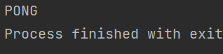

API方法名与redis的基本命令命名差不多。包括事务的使用。

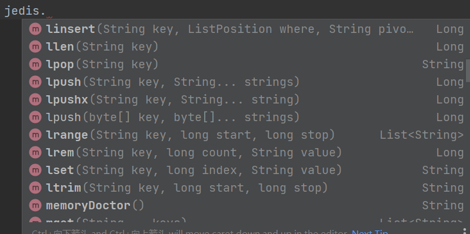

# SpringBoot整合

说明：在Springboot2.x之后，原理啊使用的jedis被替换成了lettuce

jedis：采用的是直连，多个线程操作的话，是不安全的，如果想要避免不安全，要使用jedis pool连接池！ BIO模式

lettuce：采用netty，实例可以在多个线程中进行共享，不存在线程不安全问题，可以减少线程数量，性能更加高，NIO模式

源码分析：

```java
    @Bean
    @ConditionalOnMissingBean(
        name = {"redisTemplate"}
    )
    @ConditionalOnSingleCandidate(RedisConnectionFactory.class)
    public RedisTemplate<Object, Object> redisTemplate(RedisConnectionFactory redisConnectionFactory) {
        //默认的RedisTemplate没有过多的设置，redis对象都是需要序列化！
        //两个泛型都是object，object的类型，后面使用需要强制转换！
        //中文显示问题，序列化
        RedisTemplate<Object, Object> template = new RedisTemplate();
        template.setConnectionFactory(redisConnectionFactory);
        return template;
    }

    @Bean
    @ConditionalOnMissingBean
    @ConditionalOnSingleCandidate(RedisConnectionFactory.class)//String是redis中最常使用的类型，所以单独提出来一个方法
    public StringRedisTemplate stringRedisTemplate(RedisConnectionFactory redisConnectionFactory) {
        StringRedisTemplate template = new StringRedisTemplate();
        template.setConnectionFactory(redisConnectionFactory);
        return template;
    }
```

> 整合测试一下

1. 导入依赖

   ```xml
   <!--        操作redis-->
   <dependency>
       <groupId>org.springframework.boot</groupId>
       <artifactId>spring-boot-starter-data-redis</artifactId>
   </dependency>
   
   <dependency>
       <groupId>org.springframework.boot</groupId>
       <artifactId>spring-boot-starter-web</artifactId>
   </dependency>
   
   <dependency>
       <groupId>org.springframework.boot</groupId>
       <artifactId>spring-boot-devtools</artifactId>
       <scope>runtime</scope>
       <optional>true</optional>
   </dependency>
   <dependency>
       <groupId>org.springframework.boot</groupId>
       <artifactId>spring-boot-configuration-processor</artifactId>
       <optional>true</optional>
   </dependency>
   <dependency>
       <groupId>org.projectlombok</groupId>
       <artifactId>lombok</artifactId>
       <optional>true</optional>
   </dependency>
   <dependency>
       <groupId>org.springframework.boot</groupId>
       <artifactId>spring-boot-starter-test</artifactId>
       <scope>test</scope>
   </dependency>
   ```

   

2. 配置文件

   ```properties
   #配置redis
   spring.redis.host=127.0.0.1
   spring.redis.port=6379
   ```

3. 测试

```java
//RedisTemplate 操作不同的数据类型，api和我们的指令是一样的
//opsForValue() 操作字符串，类似String
//opsForList() 操作列表，list
//。。。
//opsForHyperLogLog()

//除了基本的操作，我们常用的方法都可以直接通过redisTemplate操作，比如事务，CRUD，连接
//        RedisConnection connection = redisTemplate.getConnectionFactory().getConnection();
//        connection.flushDb();
//        connection.flushAll();

redisTemplate.opsForValue().set("mykey","潘潘潘");
System.out.print(redisTemplate.opsForValue().get("mykey"));
```

## 自定义RedisTemplate：

实体类User：

```java
@Data
@NoArgsConstructor
@AllArgsConstructor
@Component
public class User {
    private String name;
    private Integer age;
}
```

测试存储对象：

```java
@Test
void test() throws JsonProcessingException {
    User user = new User("panpan", 20);
    //springboot自带的序列化工具
    String json = new ObjectMapper().writeValueAsString(user);
    redisTemplate.opsForValue().set("user",json);
    System.out.println(redisTemplate.opsForValue().get("user"));
}
```

上面的操作在存储user之前，使用springboot自带的序列化工具序列化了对象，所以不报错，也可以获得正确结果，但是在redis中存储的确实乱码。

如果不适用`ObjectMapper`来序列化User，那么就要在实体类User上实现序列化接口，不然就会报错

```java
@Data
@NoArgsConstructor
@AllArgsConstructor
@Component
//在企业开发中，我们所有的pojo都会序列化！
public class User implements Serializable {
    private String name;
    private Integer age;
}
```

解决上述问题：自定义RedisTemplate：

## RedisTemplate模板

```java
package com.kuang.redis02springboot.config;

import com.fasterxml.jackson.annotation.JsonAutoDetect;
import com.fasterxml.jackson.annotation.PropertyAccessor;
import com.fasterxml.jackson.databind.ObjectMapper;
import com.fasterxml.jackson.databind.ser.std.StringSerializer;
import org.springframework.context.annotation.Bean;
import org.springframework.context.annotation.Configuration;
import org.springframework.data.redis.connection.RedisConnectionFactory;
import org.springframework.data.redis.core.RedisTemplate;
import org.springframework.data.redis.serializer.Jackson2JsonRedisSerializer;
import org.springframework.data.redis.serializer.StringRedisSerializer;

@Configuration
public class RedisConfig {
    //编写自己的RedisTemplate
    @Bean(name="MyRedisTemplate")
    public RedisTemplate<String, Object> redisTemplate(RedisConnectionFactory redisConnectionFactory) {
        RedisTemplate<String, Object> template = new RedisTemplate();
        template.setConnectionFactory(redisConnectionFactory);

        //Json序列化配置
        Jackson2JsonRedisSerializer jsjrs = new Jackson2JsonRedisSerializer(Object.class);
        ObjectMapper om = new ObjectMapper();
        om.setVisibility(PropertyAccessor.ALL, JsonAutoDetect.Visibility.ANY);
        om.enableDefaultTyping(ObjectMapper.DefaultTyping.NON_FINAL);
        jsjrs.setObjectMapper(om);
        //String序列化
        StringRedisSerializer stringSerializer = new StringRedisSerializer();

        //key采用String的序列化方式
        template.setKeySerializer(stringSerializer);
        //hash的key也采用String的序列化方式
        template.setHashKeySerializer(stringSerializer);
        //value的序列化方式采用jackson
        template.setValueSerializer(jsjrs);
        //hash的value序列化方式采用jackson
        template.setHashValueSerializer(jsjrs);
        template.afterPropertiesSet();


        return template;
    }
}

```

这个模板可以直接拿到新项目中使用！

**RedisUtils**:  就像`JDBC`和`MyBatis`一样，可以把常用操作封装成一个工具类，简化开发

# 配置文件

`redis.windows.conf`

可以配置端口号，持久化策略，rdb，日志，通用配置，主从复制，集群和密码等内容

文件详细解释：https://www.bilibili.com/video/BV1S54y1R7SB?p=27

# Redis持久化（重点）

面试和工作，持久化都是重点！

默认是不开启aof模式的，默认是使用rdb持久化的，在大部分情况下，rdb完全够用！

## RDB（Redis DataBase）

> 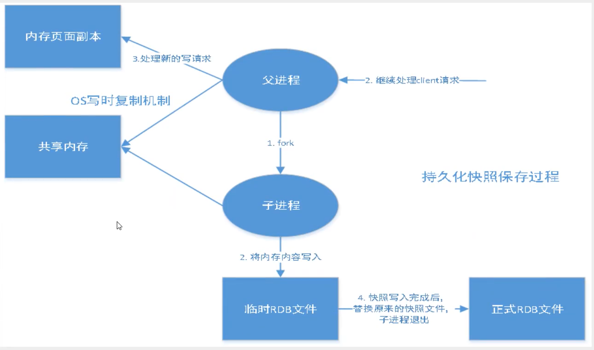

在指定的时间间隔内将内存中的数据集快照写入磁盘，也就是Snapshot快照，它恢复时是将快照文件直接读到内存中。

Redis会fork一个子进程来进行持久化，会将数据写入到一个临时文件中，待持久化过程结束了，再用这个临时文件替换上次持久化好的文件。整个过程中，主进程不进行任何IO操作，这就确保了极高的性能。如果需要进行大规模数据的恢复，并且对于数据的完整性不是非常敏感，那RDB方式要比AOF方式更加的高校。RDB的缺点是最后一次持久化后的数据可能丢失。

**rdb保存的文件就是dump.rdb**

可以在配置文件中的Snapshop中配置相关信息。

> 触发机制

1. save的规则满足的情况下，会自动触发rdb规则
2. 执行flushall命令，也会触发rdb规则
3. 退出redis服务器，也会长生rdb文件

> 如何恢复rdb文件

1. 把rdb文件放在redis启动目录即可，redis启动的时候会自动检查dump.rdb，恢复其中的数据
2. 查看需要存在的位置 `config  get dir`如果dir中存在dump.db文件，那么就会自动恢复文件中的数据

> 优点

1. 适合大规模的数据恢复
2. 对数据完整性的要求不高

> 缺点

- 需要一定的时间间隔进程操作，如果redis意外宕机了，这个最后一次修改数据就没有了
- fork进程的时候，会占用一定的内存空间


## AOF（Append Only File）

将我们的所有命令都记录下来，恢复的时候就把命令重新执行一遍

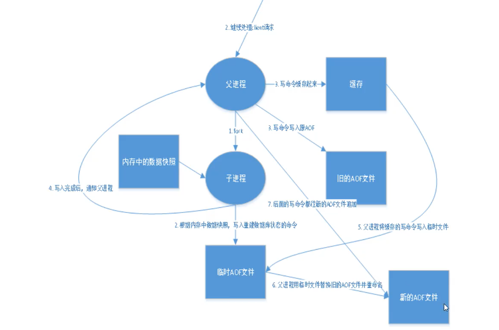

以日志的形式来记录每个写操作，将Redis执行过的所有指令记录下来（读操作不记录），只许追加文件但不可以改写文件，redis文件启动之初会读取该文件重构数据。

**aof保存的是appendonly.aof文件**

可以在配置文件中的appendonly模块配置相关信息，默认是不开启的，我们需要手动配置，把appendonly改为yes就开启了aof，重启之后就生效了。

如果这个aof文件有错误，redis是启动不起来的，我们需要使用安装目录中的redis-check-aof程序来修复aof文件，之后就可以启动redis了。

> 重新aof文件：无线追加aof文件方式会使文件体积太大，redis可以对aof文件进行后台重写，使得aof文件的体积不至于过大。

> 优点

1. 每一次修改都同步记录，文件完整性更好
2. 每秒同步一次，可能会丢失一秒数据
3. 从不同步，效率最高

> 缺点

1. aof远远大于rdb，修复速度也比rdb慢
2. aof运行效率也比rdb慢，所以我们默认使用rdb持久化

>扩展：同时开启两种持久化方式

- 这种情况下，redis重启时会优先载入aof我呢见来恢复原始的数据，因为通常情况下aof文件保存的数据更加完整
- rdb的数据不实时，但是不能只是用aof文件，因为rdb更适合用于备份数据库（aof在不断变化不好备份），快速重启，而且不会有aof可能潜在的bug，留着作为一个万一的手段。

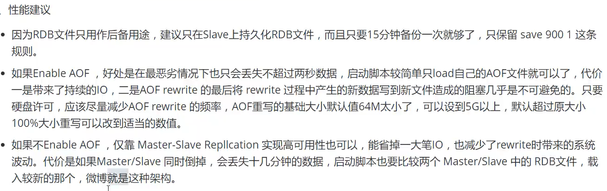

# Redis发布和订阅

是一种消息通信模式：发送者(pub)发送消息，订阅者（sub）接受消息。

## 模型

> 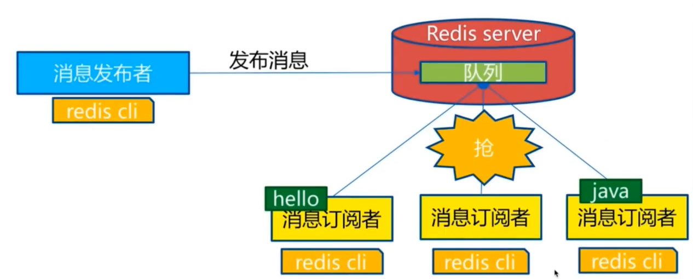

> 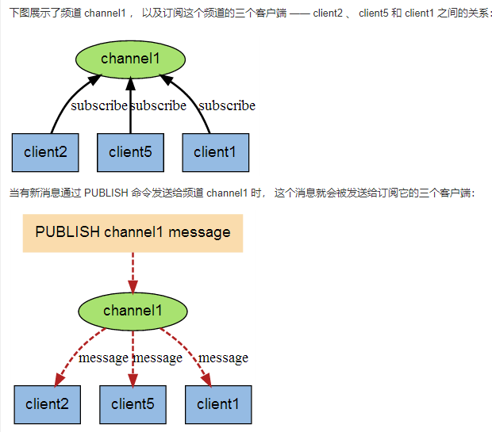

## 命令

> 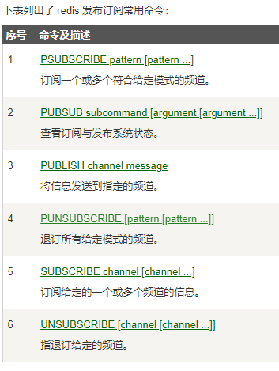

> 测试

```C:\Users\FlameZ>redis-cli
127.0.0.1:6379> publish gaki "cus"  给gaki频道发布信息
(integer) 1
127.0.0.1:6379> public gaki "great"
(error) ERR unknown command 'public'
127.0.0.1:6379>
```

```127.0.0.1:6379> subscribe gaki
127.0.0.1:6379> subscribe gaki   //订阅gaki频道
Reading messages... (press Ctrl-C to quit)
1) "subscribe"
2) "gaki"
3) (integer) 1
1) "message"
2) "gaki"
3) "cus"
```

通过subscribe命令订阅某个频道后，redis-server里维护了一个字典，字典的键就是一个个频道，而字典的值则是要给链表，链表种保存了所有订阅这个频道的客户端，subscribe就是将客户端添加到给定channel的订阅链表中。

使用场景：

1. 实时消息系统
2. 实时聊天（频道当作聊天室，将信息回显给所有人即可）
3. 订阅，关注系统都是可以的。

稍微复杂的场景我们都会使用消息中间件（rabbitMQ等）

# Redis主从复制（重点）

> 基础

1. 将一台Redis服务器的数据，复制到其他Redis服务器上，前者称为主节点（master），后者称为从节点（slave）
2. 数据的复制是**单向**的，只能由主节点到从节点
3. 主节点以写请求为主，从节点以读请求为主
4. 集群通常是**一主二从**

> 作用

1. 数据冗余：数据的热备份，是持久化之外的一种数据冗余方式
2. 故障恢复
3. 负载均衡
4. 高可用（集群）基石：主从复制是哨兵模式和集群能够实施的基础。

工程项目中，只使用一台Redis（会宕机）是万万不能的，**单台Redis最大使用内存应该不超过20G**（若超过了，就应该上集群了）

公司中，主从复制是一定要使用的。

## 环境配置

只配置从库，不配置主库（Redis默认就是主库）

```cmd
127.0.0.1:6379> info replication   //查看主从复制信息
# Replication
role:master  //默认主机
connected_slaves:0
master_replid:414e33482c683170030b3f3f4ebe4fbd5d74a526
master_replid2:0000000000000000000000000000000000000000
master_repl_offset:0
second_repl_offset:-1
repl_backlog_active:0
repl_backlog_size:1048576
repl_backlog_first_byte_offset:0
repl_backlog_histlen:0
```

同一个机器上开启多个Redis服务器，需要有多个配置文件（可以复制原有的配置文件得来），每个文件的下列信息必须不同：

1. port
2. pidfile名字
3. logfile名字
4. dump.rdb名字

> redis-server  配置文件名

上面的命令就可以启动对应配置文件的Redis。

## 一主二从

默认情况下，每台Redis都是主节点，我们一般只需要配置从机就可以了

认老大，一主(6379端口)二从（6380和6381端口）

### 命令方式

使用Redis 客户端连接从机Redis服务器之后，输入下面的命令让它认老大：

```shell
slaveof ip  port
```

就把本从机当成ip：port上运行的主机Redis当成老大了。

### 配置文件方式

命令方式是暂时的，真实的配置中应该是在配置文件中配置的，这样的话就是永久的

从机配置文件的replication部分:

```replicaof  masterip masterport
replicaof  masterip masterport
```

### 细节

**主机可以写，从机只能读！**主机所有的内容，都会被从机自动保存。

主机断开连接，从机一九连接到主机的，但是没有写操作了，等主机恢复了之后，从机又可以读取到主机写的内容了。

如果是使用命令行配置的从机，重启之后就会变成主机！只要变成从机，立马就会从主机中复制数据过来：

> 复制原理：
>
> - 全量复制：Slave启动成功连接到Master后会发送一个sync命令，master接到命令之后，会将整个数据文件传到slave，并完成一次完全同步
> - 增量复制：Master继续将所有收集到的修改命令一次传给slave，完成同步

### 主机宕机处理

> 主机宕机之后，迟迟不能恢复，此时从机也不能写，那么redis集群就崩了，怎么处理？

我们可以使用`slaveof no one` 来让自己变成主机，其他节点就可以**手动**连接到最新的这个主节点（手动）

但是这种方式还是麻烦，处理方式是接下来介绍的**哨兵模式**！

### 哨兵模式（重点）

自动选Master模式。这是工作中使用的模式，之前的都是原理。

Redis从2.8开始正式提供了Sentinel(哨兵)架构来解决自动选举Master问题。

> 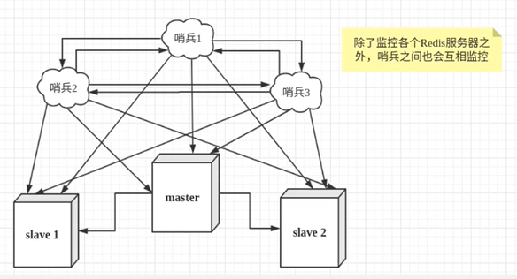

因为哨兵进程可能也会宕机，所以哨兵也是一个集群，相互之间进行监控并监控Redis服务器。

在Redis安装目录下有Redis-sentinel这个运行程序，这个就是哨兵程序，运行之后就是哨兵进程。

> 处理过程

master宕机之后，哨兵1先检测到这个结果，系统并不会马上进行failover(故障转移)操作，仅仅是哨兵1主观认为主服务器不可用，这个现象称为**主观下线**，当后面的哨兵也检测到master不可用，并且达到一定数量时，那么哨兵hi见就会进行一次投票，投票的结果由一个哨兵发起，进行failover操作。切换成功后，就会通过发布订阅模式，让各个哨兵把自己监控的从服务器实现切换主机，这个过程称为**客观下线**。

> 测试

一主二从和一个哨兵

1. 增加哨兵配置文件sentinel.conf

   

   ```conf
   sentinel moniter mysentinel 127.0.0.1 6379 1
   ```

   mysentinel是这个哨兵进程的名字，后面的ip和端口号是master的ip和port，最后面这个1代表如果主机挂了，slave投票看让谁成为主机，票数最多的，就会称为主机。

   实际的sentinel.conf配置文件内要配置的信息相当的多，上面的内容只是最基本的内容。

   完整的配置文件示例如下：

   ```shell
   # Example sentinel.conf  
     
   # 哨兵sentinel实例运行的端口 默认26379  
   # 多哨兵集群的话就要配置不同的port
   port 26379  
     
   # 哨兵sentinel的工作目录  
   dir /tmp  
     
   # 哨兵sentinel监控的redis主节点的 ip port   
   # master-name  可以自己命名的主节点名字 只能由字母A-z、数字0-9 、这三个字符".-_"组成。  
   # quorum 当这些quorum个数sentinel哨兵认为master主节点失联 那么这时 客观上认为主节点失联了  
   # sentinel monitor <master-name> <ip> <redis-port> <quorum>  
     sentinel monitor mymaster 127.0.0.1 6379 2  
     
   # 当在Redis实例中开启了requirepass foobared 授权密码 这样所有连接Redis实例的客户端都要提供密码  
   # 设置哨兵sentinel 连接主从的密码 注意必须为主从设置一样的验证密码  
   # sentinel auth-pass <master-name> <password>  
   sentinel auth-pass mymaster MySUPER--secret-0123passw0rd  
     
     
   # 指定多少毫秒之后 主节点没有应答哨兵sentinel 此时 哨兵主观上认为主节点下线 默认30秒  
   # sentinel down-after-milliseconds <master-name> <milliseconds>  
   sentinel down-after-milliseconds mymaster 30000  
     
   # 这个配置项指定了在发生failover主备切换时最多可以有多少个slave同时对新的master进行 同步，  
   这个数字越小，完成failover所需的时间就越长，  
   但是如果这个数字越大，就意味着越 多的slave因为replication而不可用。  
   可以通过将这个值设为 1 来保证每次只有一个slave 处于不能处理命令请求的状态。  
   # sentinel parallel-syncs <master-name> <numslaves>  
   sentinel parallel-syncs mymaster 1  
     
     
     
   # 故障转移的超时时间 failover-timeout 可以用在以下这些方面：   
   #1. 同一个sentinel对同一个master两次failover之间的间隔时间。  
   #2. 当一个slave从一个错误的master那里同步数据开始计算时间。直到slave被纠正为向正确的master那里同步数据时。  
   #3.当想要取消一个正在进行的failover所需要的时间。    
   #4.当进行failover时，配置所有slaves指向新的master所需的最大时间。不过，即使过了这个超时，slaves依然会被正确配置为指向master，但是就不按parallel-syncs所配置的规则来了  
   # 默认三分钟  
   # sentinel failover-timeout <master-name> <milliseconds>  
   sentinel failover-timeout mymaster 180000  
     
   # SCRIPTS EXECUTION  
     
   #配置当某一事件发生时所需要执行的脚本，可以通过脚本来通知管理员，例如当系统运行不正常时发邮件通知相关人员。  
   #对于脚本的运行结果有以下规则：  
   #若脚本执行后返回1，那么该脚本稍后将会被再次执行，重复次数目前默认为10  
   #若脚本执行后返回2，或者比2更高的一个返回值，脚本将不会重复执行。  
   #如果脚本在执行过程中由于收到系统中断信号被终止了，则同返回值为1时的行为相同。  
   #一个脚本的最大执行时间为60s，如果超过这个时间，脚本将会被一个SIGKILL信号终止，之后重新执行。  
     
   #通知型脚本:当sentinel有任何警告级别的事件发生时（比如说redis实例的主观失效和客观失效等等），将会去调用这个脚本，  
   这时这个脚本应该通过邮件，SMS等方式去通知系统管理员关于系统不正常运行的信息。调用该脚本时，将传给脚本两个参数，  
   一个是事件的类型，  
   一个是事件的描述。  
   如果sentinel.conf配置文件中配置了这个脚本路径，那么必须保证这个脚本存在于这个路径，并且是可执行的，否则sentinel无法正常启动成功。  
   #通知脚本  
   # sentinel notification-script <master-name> <script-path>  
     sentinel notification-script mymaster /var/redis/notify.sh  
     
   # 客户端重新配置主节点参数脚本  
   # 当一个master由于failover而发生改变时，这个脚本将会被调用，通知相关的客户端关于master地址已经发生改变的信息。  
   # 以下参数将会在调用脚本时传给脚本:  
   # <master-name> <role> <state> <from-ip> <from-port> <to-ip> <to-port>  
   # 目前<state>总是“failover”,  
   # <role>是“leader”或者“observer”中的一个。   
   # 参数 from-ip, from-port, to-ip, to-port是用来和旧的master和新的master(即旧的slave)通信的  
   # 这个脚本应该是通用的，能被多次调用，不是针对性的。  
   # sentinel client-reconfig-script <master-name> <script-path>  
    sentinel client-reconfig-script mymaster /var/redis/reconfig.sh 
   ————————————————
   版权声明：本文为CSDN博主「盘子李」的原创文章，遵循CC 4.0 BY-SA版权协议，转载请附上原文出处链接及本声明。
   原文链接：https://blog.csdn.net/u012441222/article/details/80751390
   ```

   

2. 启动哨兵！

   ```shell
   redis-sentinel sentinel.conf
   ```

   监控了Master之后，会自动获得slave的信息，所以配置文件中不用配置从机的信息。

**如果原来的主机恢复了之后，就只能当作新主机的从机了！**


# 缓存穿透和雪崩（面试，工作中重要）

都是服务器的高可用问题

## 缓存穿透（查不到）

> 概念

用户想要查询一个数据，发现redis内存数据库中没有，缓存也就没用命中，于是查询mysql等持久层数据库，发现也没有，于是查询失败。当用户很多时，缓存都没有命中(如秒杀)，于是都去请求了持久层数据库，这会给持久层数据库造成很大压力，这就是缓存穿透！

> 举例：有攻击者故意一直查询缓存中不存在的key

> 解决方案

**布隆过滤器**

布隆过滤器是一种数据结构，对所有可能查询的参数以hash形式存储，在控制层先进程校验，不符合则丢弃，从而避免了对底层存储系统的查询压力。

> 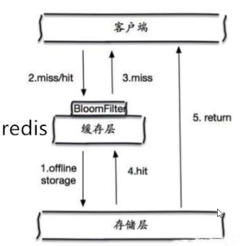

**缓存空对象**

当存储层不命中之后，即是返回的空对象也将其缓存起来，同时会设置一个过期时间，之后再访问这个数据就会从缓存中获取，保护了后端数据源。

> 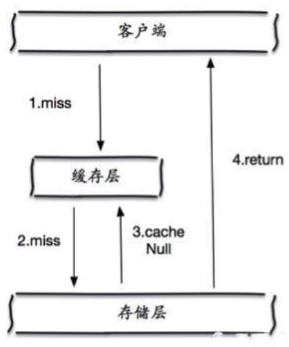

但是这个方法会存在两个问题：

1. 如果空值也被缓存起来，这就意味着需要更多的空间存储更多的键，因为其中会有很多空值的键
2. 即使对空值设置了过期时间，还是会存在缓存层和存储层的数据会有一段时间窗口的不一致，这队医需要保存一致性的业务会有影响


## 缓存击穿（缓存过期后，量太大）

> 概念

需要注意和缓存穿透的区别。缓存击穿是指一个key非常热点，在不停的扛着大并发，大并发集中对这一个点进行访问，当这个key在失效的瞬间，持续的大并发就在缓存中找不到这个key，就击穿到mysql中进行查询。这些大并发就像一枚子弹打在缓存上的某一个点，并把这个点给打穿了，从而造成系统的崩溃。

> 举例

“爆”热搜造成微博的瘫痪。

> 解决方案

**设置热点数据永不过期**

**加互斥锁**

分布式锁：使用分布式锁，保证对于每一个key同时只有一个线程查询后端服务，其他线程没有获得分布式锁的权限，因此只需要等待即可。这种方式将高并发的压力转移到了分布式锁，因此对分布式锁的考验很大。

## 缓存雪崩

> 概念

是指某一个时间段，缓存集中过期失效或者Redis宕机！

> 举例

双十一抢购前，很多热点商品被批量放入缓存中，假如过期时间是一小时。12点开始抢购，那么到了凌晨一点的时候，这批商品的缓存就过期了，而对这批商品的访问查询，都落到了数据库上，对于数据库而言，就会产生周期性的压力波峰。于是所有的请求都会到达存储层，存储层的调用量就会暴增，造成存储层也会挂掉的情况。

> 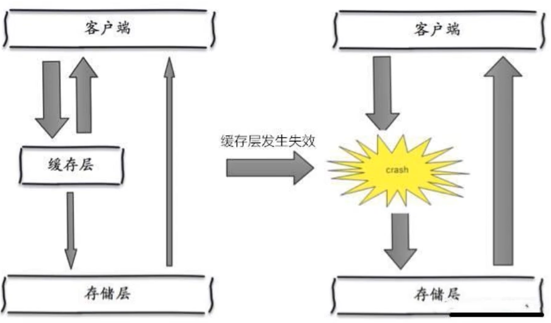

> 解决方案

**redis高可用**

针对redis会挂掉的问题，多增设几台reids（集群）

**限流降级**（SpringCloud中讲解过）

在缓存失效后，通过加锁或者队列来控制读数据库写缓存的线程数量。

**数据预热**

就是在正式部署前，先把可能的数据先预先访问一遍，这样部分可能大量访问的数据就会加载到缓存中。在即将发生大并发访问前手动触发加载不同key的缓存，设置不同的过期时间，让缓存失效的时间点尽量均匀。