# SpringMVC

MVC:    模型(dao,service)     视图(jsp,html)    控制器（Servlet）

控制器：转发，重定向等

**职责分析：**

Controller：控制器

- 取得表单数据
- 调用业务逻辑
- 转向指定的页面

Model：模型

- 业务逻辑（service）
- 保存数据的状态（dao）

VIew：视图

- 显示页面


另有其他的架构，如MVVM。

MVVM： M(model)    V(view)     VM(ViewModel)

vue框架中用的就是VM，原理就是双向绑定


前端页面想要用户可见，放在web下；用户不可见，就放到web-inf下

基础依赖

```xml
<dependency>
            <groupId>javax.servlet</groupId>
            <artifactId>javax.servlet-api</artifactId>
            <version>4.0.1</version>
        </dependency>
        <dependency>
            <groupId>javax.servlet.jsp</groupId>
            <artifactId>jsp-api</artifactId>
            <version>2.2</version>
        </dependency>
        <dependency>
            <groupId>javax.servlet</groupId>
            <artifactId>jstl</artifactId>
            <version>1.2</version>
        </dependency>
```


# springMVC原理

## web.xml

```xml
<?xml version="1.0" encoding="UTF-8"?>
<web-app xmlns="http://xmlns.jcp.org/xml/ns/javaee"
         xmlns:xsi="http://www.w3.org/2001/XMLSchema-instance"
         xsi:schemaLocation="http://xmlns.jcp.org/xml/ns/javaee http://xmlns.jcp.org/xml/ns/javaee/web-app_4_0.xsd"
         version="4.0">
<!--    1.注册dispatcherservlet-->
    <servlet>
        <servlet-name>springmvc</servlet-name>
        <servlet-class>org.springframework.web.servlet.DispatcherServlet</servlet-class>
<!--     dispatcherservlet要绑定一个spring的配置文件-->
        <init-param>
            <param-name>contextConfigLocation</param-name>
            <param-value>classpath:springmvc-servlet.xml</param-value>
        </init-param>
        <!--         启动级别-->
        <load-on-startup>1</load-on-startup>
    </servlet>
<!--    / 匹配所有的请求：（不包括.jsp）-->
<!--    /* 匹配所有的请求：（包括.jsp）-->
    <servlet-mapping>
        <servlet-name>springmvc</servlet-name>
        <url-pattern>/</url-pattern>
    </servlet-mapping>
</web-app>

```

其中springmvc-servlet.xml是spring的配置文件（bean）


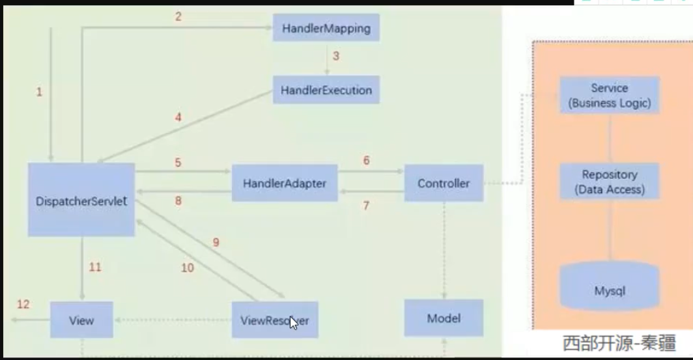

在spring配置文件中的bean就须配置上图中关键步骤类的三个bean，如下：

```xml
<?xml version="1.0" encoding="UTF-8"?>
<beans xmlns="http://www.springframework.org/schema/beans"
       xmlns:xsi="http://www.w3.org/2001/XMLSchema-instance"
       xsi:schemaLocation="http://www.springframework.org/schema/beans
    https://www.springframework.org/schema/beans/spring-beans.xsd">
<!--    处理器映射器-->
    <bean class="org.springframework.web.servlet.handler.BeanNameUrlHandlerMapping"/>
<!--    处理器适配器-->
    <bean class="org.springframework.web.servlet.mvc.SimpleControllerHandlerAdapter"/>

<!--    视图解析器：DispatcherServlet给他的ModelAndView-->
    <bean id="internalResourceViewResolver" class="org.springframework.web.servlet.view.InternalResourceViewResolver">
<!--        前缀-->
        <property name="prefix" value="/WEB-INF/jsp/"/>
<!--        后缀-->
        <property name="suffix" value=".jsp"/>
    </bean>

<!--注意写一个controller就要加一个bean/-->
    <bean id="/hello" class="com.kuang.controller.HelloController"/>


</beans>

```

注意：

- InternalResourceViewResolver必须配置，其他两个可以省略。

- thymeleaf 和 freemarker就是模板引擎，可以用来替代InternalResourceViewResolver

- 每写一个controller都要在这个配置文件中配置bean

**以上是原理，实际开发中使用注解开发，更简单。**

## springmvc-servlet.xml（注解）

```xml
<?xml version="1.0" encoding="UTF-8"?>
<beans xmlns="http://www.springframework.org/schema/beans"
       xmlns:xsi="http://www.w3.org/2001/XMLSchema-instance"

       xmlns:context="http://www.springframework.org/schema/context"
       xmlns:mvc="http://www.springframework.org/schema/mvc"

       xsi:schemaLocation="http://www.springframework.org/schema/beans
    https://www.springframework.org/schema/beans/spring-beans.xsd

    http://www.springframework.org/schema/context
    https://www.springframework.org/schema/context/spring-context.xsd
    http://www.springframework.org/schema/mvc
    https://www.springframework.org/schema/mvc/spring-mvc.xsd">
<!--    自动扫描包-->
    <context:component-scan base-package="com.kuang.controller"/>
<!--springMVC不处理静态资源 如html，css等资源-->
    <mvc:default-servlet-handler/>
<!--    自动配置了之前的HandlerMapping和handlerAdapter-->
    <mvc:annotation-driven/>
<!--视图解析器-->
    <bean class="org.springframework.web.servlet.view.InternalResourceViewResolver"
          id="internalResourceViewResolver">
        <property name="prefix" value="/WEB-INF/jsp/"/>
        <property name="suffix" value=".jsp"/>
    </bean>


</beans>

```

注解版的不需要写完一个controller就在配置文件中配置bean了

写一个controller

```java
@Controller
public class HelloController{
    @RequestMapping("/hello") //网路请求过来 https://localhost:8080/hello请求
    public String hello(Model model){
        //封装数据, Model可以在jsp中取出并渲染
        model.addAttribute("msg","Annotation Develop springMVC");
        return "hello";//视图的名字，会被视图解析器解析为具体路径 即跳转到/WEB-INF/jsp/hello.jsp页面
    }

}
```

- @RequestMapping("/hello") 说明方法hello是处理https://localhost:8080/hello过来的请求

- model的内容会自动渲染到前端。

- hello方法返回的字符串"hello"说明即将加载的页面是hello.jsp页面


# Controller

## 实现Controller接口

一个类只能写一个方法，方法很多的话，会导致需要新建的页面很多；另外每写完一个Controller之后需要配置文件中添加bean(使用name属性配置网络请求的入口),  此种方法落后，不推荐使用。

例子：

```java
public class ControllerTest1 implements Controller {
    @Override
    public ModelAndView handleRequest(HttpServletRequest httpServletRequest, HttpServletResponse httpServletResponse) throws Exception {
        ModelAndView modelAndView = new ModelAndView();
        modelAndView.addObject("msg","ControllerTest implements Controller");
        modelAndView.setViewName("test");
        return modelAndView;
    }
}
```

## 使用注解@Controller

一个类中可以写多个请求处理方法！推荐使用，例子如下：

```java
@Controller
public class ControllerTest2 {
    @RequestMapping("/t2")  //处理https:/localhost:8080/t2的请求
    public String test2(Model model){
        model.addAttribute("msg","@Controller");
        return "test";//定位到test.jsp页面
    }

    @RequestMapping("love")//处理https:/localhost:8080/love的请求
    public String test3(Model model){
        model.addAttribute("msg","杨红焰love   ");
        return "test";//定位到test.jsp页面
    }
}
```

## Restful请求风格

在链接中传参时，方式有:

```
传统的请求方式：https:localhost:8080/add?a=1&b=3
Restful风格：https:localhost:8080/add/a/b
```

```java
@RequestMapping(value="/add/{a}/{b}")
    public String test(@PathVariable int a,@PathVariable int b, Model model){
        int res = a+b;
        model.addAttribute("msg","结果为"+res);
        return "test";
    }
```

- 输入https:localhost:8080/add/1/3   可以调用到这个Controller

- @PathVariable为把对应路径上的字符绑定到参数上


上述代码可以优化为：

```java
@RequestMapping(value="/add/{a}/{b}",method = RequestMethod.GET)
```

增加为了方法，这样就可以根据get方法来进一步区分

上述代码还可以简化为：

```java
@GetMapping("/add1/{a}/{b}")
```


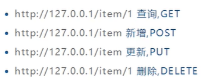

此外，如上图输入相同的链接，但是却能实现不同的功能，这主要是由于不同的功能是根据请求方法来确定的

```java
@RequestMapping(value="/add/{a}/{b}",method = RequestMethod.GET)
    public String test(@PathVariable int a,@PathVariable int b, Model model){
        int res = a+b;
        model.addAttribute("msg","结果1为"+res);
        return "test";
    }
@RequestMapping(value="/add/{a}/{b}",method = RequestMethod.POST)
    public String test2(@PathVariable int a,@PathVariable int b, Model model){
        int res = a+b;
        model.addAttribute("msg","结果2为"+res);
        return "test";
    }
```

这两个方法除了请求方法设置不一样之外都一致。

在浏览器发出get请求时，就会调用到test()方法。类似，post请求时调用test2()方法。

请求类型可在前端表单设置，默认时get方法。

请求方法类型有：

```
GET,HEAD,POST,PUT,PATCH,DELETE,OPTIONS,TRACE;
```


## 结果跳转方式

1、ModelAndView	要用视图解析器

2、ServletAPI  方式    不需要视图解析器（使用重定向和转发）

3、springMVC 方式  可以不需要视图解析器，但是需要在Controller下的每个方法写下完整的页面地址。当没有视图解析器时：

- "/WEB-INF/jsp/test.jsp": 跳转到这个页面
- "forward:/WEB-INF/jsp/test.jsp":跳转到test.jsp页面
- "redirect:/WEB-INF/jsp/test.jsp": 重定向到test.jsp页

当有视图解析器时：

- "test":跳转

- "redirect:/test":重定向

重定向和跳转：重定向时两次请求，不能传递参数；而跳转是一次请求，可以传参。

注意：不能重定向到WEB-INF文件夹下的页面！


## 数据显示到前端：

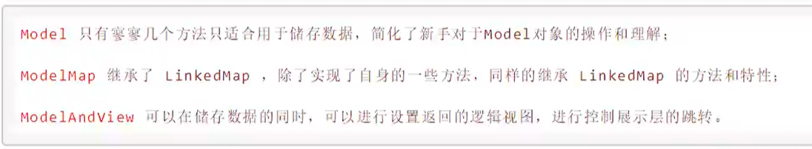


## 处理提交数据

如http://localhost:8080/hello?name=yang

1、提交的域名称和处理方法的参数名一致：默认即可

2、提交的域名称和处理方法的参数名不一致：函数参数前添加@RequestParam("name")即可

3、提交的是一个对象（提交的都是一个对象中的属性值): 函数参数直接写对象类型即可（但是对象属性名和提交的参数名必须一致，不一致的话其对应属性值为null）

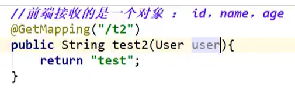


# 乱码问题

当前端页面中文提交到后台时产生乱码。或者post方法时中文提交后出现乱码，但是get方法提交后没有乱码。

解决方法1：修改tomcat安装目录的服务器配置文件conf/server.xml, 增加URIEncoding="UTF-8"

```xml
<Connector URIEncoding="UTF-8" port="8080" protocol="HTTP/1.1"
               connectionTimeout="20000"
               redirectPort="8443" />
```


解决方法2：在web.xml中配置过滤器！

```xml
<filter>
        <filter-name>encoding</filter-name>
        <filter-class>org.springframework.web.filter.CharacterEncodingFilter</filter-class>
        <init-param>
            <param-name>encoding</param-name>
            <param-value>utf-8</param-value>
        </init-param>
    </filter>
    <filter-mapping>
        <filter-name>encoding</filter-name>
        <url-pattern>/*</url-pattern>
    </filter-mapping>
```


## web.xml（过滤器版）

```xml
<?xml version="1.0" encoding="UTF-8"?>
<web-app xmlns="http://xmlns.jcp.org/xml/ns/javaee"
         xmlns:xsi="http://www.w3.org/2001/XMLSchema-instance"
         xsi:schemaLocation="http://xmlns.jcp.org/xml/ns/javaee http://xmlns.jcp.org/xml/ns/javaee/web-app_4_0.xsd"
         version="4.0">
    <servlet>
        <servlet-name>springmvc</servlet-name>
        <servlet-class>org.springframework.web.servlet.DispatcherServlet</servlet-class>
        <init-param>
            <param-name>contextConfigLocation</param-name>
            <param-value>classpath:springmvc-servlet.xml</param-value>
        </init-param>
        <load-on-startup>1</load-on-startup>
    </servlet>

    <servlet-mapping>
        <servlet-name>springmvc</servlet-name>
        <url-pattern>/</url-pattern>
    </servlet-mapping>

    <filter>
        <filter-name>encoding</filter-name>
        <filter-class>org.springframework.web.filter.CharacterEncodingFilter</filter-class>
        <init-param>
            <param-name>encoding</param-name>
            <param-value>utf-8</param-value>
        </init-param>
    </filter>
    <filter-mapping>
        <filter-name>encoding</filter-name>
        <url-pattern>/*</url-pattern>
    </filter-mapping>
</web-app>
```

# json


json就是一种数据格式，与语言无关，可以在前后端之间使用json来传递信息增加效率。

常用的有jackson、和fastjson等包

导入依赖：

```xml
<dependencies>
        <dependency>
            <groupId>com.fasterxml.jackson.core</groupId>
            <artifactId>jackson-databind</artifactId>
            <version>2.9.10.6</version>
        </dependency>
    </dependencies>
```

## 返回前端

### 普通方法

直接传字符串：

```java
    @RequestMapping("/c1")
    @ResponseBody //不会走视图解析器，直接向当前页面返回一个字符串。
    public String test(){
        User user = new User("杨红焰", 2, "男");
        return user.toString();
    }
```

访问页面后，中文出现乱码：

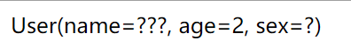

@ResponseBody ：不会走视图解析器，直接向当前页面返回一个字符串。


### json方法

#### jackson

使用jackson的ObjectMapper对象来操作，writeValueAsString()方法来把对象转化为json格式的字符串：

```java
@RequestMapping(value = "/c1",produces = "application/json;charset=utf-8")
    @ResponseBody //不会走视图解析器，直接向当前页面返回一个字符串。
    public String test() throws JsonProcessingException {
        User user = new User("杨红焰", 3, "男");
        ObjectMapper mapper = new ObjectMapper();
        String s = mapper.writeValueAsString(user);
        return s;
    }
```

结果为：

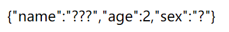

可以看到两种方法输出的格式不一样。


如果整个Controller类中的每个方法都需要直接返回字符串而不需要转发和重定向，在每个方法上都加上@ResponseBody显得太麻烦，可以直接把@Controller替换成@RestController

```java
@RestController
public class UserController {
    @RequestMapping("/j1")
    public String test() throws JsonProcessingException {
        User user = new User("杨红焰", 2, "男");
        ObjectMapper mapper = new ObjectMapper();
        String s = mapper.writeValueAsString(user);
        return s;
    }
}
```


#### fastjson

fastjson使阿里开源的包，里面有很多静态方法，不需要创建对象。

导入依赖：

```xml
<dependency>
            <groupId>com.alibaba</groupId>
            <artifactId>fastjson</artifactId>
            <version>1.2.73</version>
        </dependency>
```

使用方法：

```java
@RequestMapping(value="/fast")
    public String test1() throws JsonProcessingException {
        User user = new User("杨红焰", 2, "男");
        String s = JSON.toJSONString(user);
        return s;
    }
```

结果：

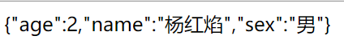

常用方法：

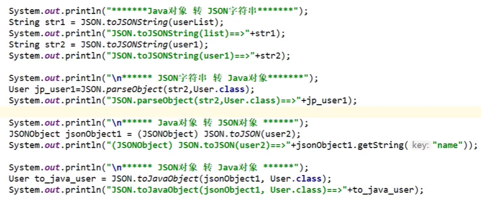


## 乱码处理

在@RequestMapping上添加字符编码设置

```java
@RequestMapping(value = "/c1",produces = "application/json;charset=utf-8")
```

上面的方式比较麻烦，需要在每个方法中的@RequestMapping中添加，可以统一在核心配置文件中处理：

```xml
<mvc:annotation-driven>
        <mvc:message-converters register-defaults="true">
            <bean class="org.springframework.http.converter.StringHttpMessageConverter">
                <constructor-arg value="UTF-8"/>
            </bean>
            <bean class="org.springframework.http.converter.json.MappingJackson2HttpMessageConverter">
                <property name="objectMapper">
                    <bean class="org.springframework.http.converter.json.Jackson2ObjectMapperFactoryBean">
                        <property name="failOnEmptyBeans" value="false"/>
                    </bean>
                </property>
            </bean>
        </mvc:message-converters>
    </mvc:annotation-driven>
```

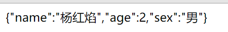


## springmvc-servlet.xml（传输乱码）

```xml
<?xml version="1.0" encoding="UTF-8"?>
<beans xmlns="http://www.springframework.org/schema/beans"
       xmlns:xsi="http://www.w3.org/2001/XMLSchema-instance"

       xmlns:context="http://www.springframework.org/schema/context"
       xmlns:mvc="http://www.springframework.org/schema/mvc"

       xsi:schemaLocation="http://www.springframework.org/schema/beans
    https://www.springframework.org/schema/beans/spring-beans.xsd

    http://www.springframework.org/schema/context
    https://www.springframework.org/schema/context/spring-context.xsd
    http://www.springframework.org/schema/mvc
    https://www.springframework.org/schema/mvc/spring-mvc.xsd">

    <context:component-scan base-package="com.kuang.controller"/>
    <mvc:annotation-driven>
        <mvc:message-converters register-defaults="true">
            <bean class="org.springframework.http.converter.StringHttpMessageConverter">
                <constructor-arg value="UTF-8"/>
            </bean>
            <bean class="org.springframework.http.converter.json.MappingJackson2HttpMessageConverter">
                <property name="objectMapper">
                    <bean class="org.springframework.http.converter.json.Jackson2ObjectMapperFactoryBean">
                        <property name="failOnEmptyBeans" value="false"/>
                    </bean>
                </property>
            </bean>
        </mvc:message-converters>
    </mvc:annotation-driven>

    <bean class="org.springframework.web.servlet.view.InternalResourceViewResolver"
          id="internalResourceViewResolver">
        <property name="prefix" value="/WEB-INF/jsp/"/>
        <property name="suffix" value=".jsp"/>
    </bean>

</beans>

```


# SSM整合

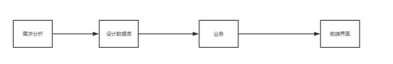

## Mybatis整合

具体看spring-study项目中做的子项目: **ssmbuild**，ssmbuild-1是ssm框架的基础部分，ssmbuild是在这个基础上添加的一些网站功能。

# Ajax

异步提交表单，不需要刷新页面 就能提前查询一些后台数据，比如搜索栏输入“中国”，下面会自动提示各种包含"中国"字样的条目。

可以使用Jquery库和js原生操作，还有各种前端框架实现。

Jquery库实现Ajax

首先要去官网下载这个库文件，然后放在web目录下，之后在需要使用库的前端页面中引用：

```xml
<script src="${pageContext.request.contextPath}/static/jQuery-3.4.1.js"></script>
```

注意：js后缀等静态文件，需要在spring核心配置文件中添加静态资源过滤之后才能被加入到spring中，否则不能使用：

```xml
<mvc:default-servlet-handler/>
```

前端页面示例：

```xml
<%@ page contentType="text/html;charset=UTF-8" language="java" %>
<html>
  <head>
    <title>$Title$</title>
<%--    引用jquery库--%>
    <script src="${pageContext.request.contextPath}/static/jQuery-3.4.1.js"></script>
    <script>
      function on(){
        $.post({
          url:"${pageContext.request.contextPath}/all",
          data:{"name":$("#username").val()},
          success:function (data){
            alert(data)
          },
          error:function (data){
            alert(data)
          }
        })
      }
    </script>

  </head>
  <body>

  用户名:<input type="text" id="username" onblur="on()" value="杨红">

  </body>
</html>

```

会根据各种事件，如onblur，发生时，调用其回调函数，然后再回调函数中向后台发出相关查询操作。$.post()表示jquery库的post方法发起请求，参数是对象(重要的就是下面这几个参数)：

- url：请求的后端rul入口
- data：传给后台的数据
- success：成功返回时的回调函数
- error：失败时的回调函数

$("#username")是jquery取id=username的组件的一种方式。

下面这个是jquery的自加载函数。

```javascript
$(function (){
            
        })
```


用户登录时账号密码异步检测合法性：

```jsp
<%@ page contentType="text/html;charset=UTF-8" language="java" %>
<html>
<head>
    <title>Title</title>
    <script src="${pageContext.request.contextPath}/static/jQuery-3.4.1.js"></script>
    <script>
        function check(){
            $.post({
                url:"${pageContext.request.contextPath}/loginCheck",
                data:{"name":$("#user").val()},
                success:function (data){
                    if(data.toString()=="ok"){
                        $("#userInfo").css("color","green");
                    }else{
                        $("#userInfo").css("color","red");
                    }
                    $("#userInfo").html(data);
                }
            })
        }
        function check1(){
            $.post({
                url:"${pageContext.request.contextPath}/pwdCheck",
                data:{"pwd":$("#pwd").val()},
                success:function (data){
                    if(data.toString()=="ok"){
                        $("#pwdInfo").css("color","green");
                    }else{
                        $("#pwdInfo").css("color","red");
                    }
                    $("#pwdInfo").html(data);
                }
            })
        }
    </script>
</head>
<body>
<p>
    用户名：<input type="text" id="user" onblur="check()">
    <span id="userInfo"></span>
</p>
<p>
    密码：<input type="password" id="pwd" onblur="check1()">
    <span id="pwdInfo"></span>
</p>
</body>
</html>

```


# 拦截器

拦截器是spring-mvc自带的，而过滤器任何java web工程都能使用，过滤器配置再web.xml文件中，拦截器配置在spring 核心配置文件中

拦截器只会拦截控制器中的方法，如果访问jsp /css /js /html等静态资源是不会拦截的。

写自己的拦截类，要继承HandlerInterceptor接口

```java
public class MyIntercepter implements HandlerInterceptor {
    //拦截前
    //返回true，则放行则放行到下一个拦截器
    //放回false，则拦截此请求
    public boolean preHandle(HttpServletRequest request, HttpServletResponse response, Object handler) throws Exception {
        System.out.println("==========拦截前============");
        return false;
    }
    //拦截后
    //通常用来写日志
    public void postHandle(HttpServletRequest request, HttpServletResponse response, Object handler, ModelAndView modelAndView) throws Exception {
        System.out.println("==========拦截后============");
    }
    //清理
    public void afterCompletion(HttpServletRequest request, HttpServletResponse response, Object handler, Exception ex) throws Exception {
        System.out.println("==========清理============");
    }
}
```

再spring核心配置文件中配置拦截器：

```xml
<!--    配置拦截器-->
    <mvc:interceptors>
        <mvc:interceptor>
<!--            包括此请求下的所有请求-->
            <mvc:mapping path="/**"/>
            <bean class="com.kuang.config.MyIntercepter"/>
        </mvc:interceptor>
    </mvc:interceptors>
```

bean是自己写的拦截类，path是要拦截的请求路径，/**表示路径下的所有请求,比如 :

/admin/**就是表示要拦截localhost:8080/admin路径下的所有请求

拦截器常用于登录功能，没登陆的则不能进入网站。


把登录信息存在HttpSession中，这个对象和存活一段时间，其他的方式不行。例子如下：

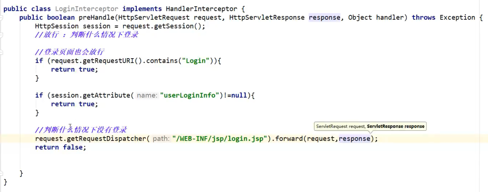

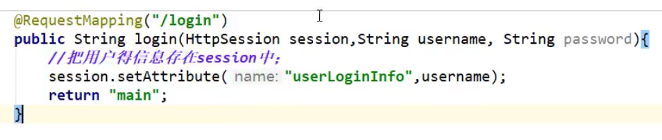

登陆时保存信息到session中。

# 文件上传和下载


# github:springmvc-study

具体的学习过程和代码在自己的github上，叫springmvc-study