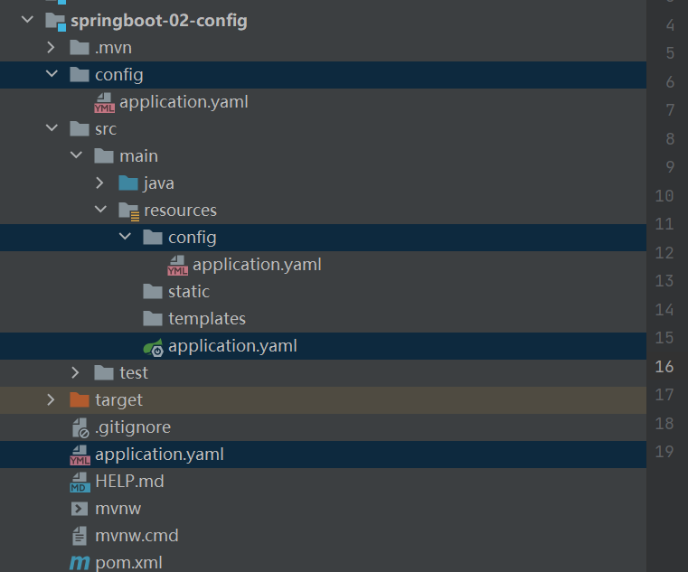

# 微服务

mvc-->mvvm-->微服务架构

把三层架构中的服务分成小模块，小模块分布在不同主机上，这些小模块就叫微服务。架构演变如下：


微服务之间可以通过http或rpc实现


# 第一个springboot环境

官方提供了一个快速生成的网站，IDEA也集成了这个网站。

推荐使用IDEA直接创建springboot项目：Spring-initialzar

打jar包后运行过程：


之后会在target目录下生成对应jar包，在cmd中运行 java -jar jar包名    之后这个微服务就在主机上布置起来了；如果有Controller接口，在浏览器数据对应地址就可以访问这个Controller了


# springboot banner 在线生成工具

https://www.bootschool.net/ascii

可以生成各种好玩的符号图像。

在resources目录下新建banner.txt文件，再把生成的图像拷贝进去，之后启动应用就会输出这个文件中的图像。


小技巧：若插件下载失败了就在项目的lifetime下的install一下


# 原理

自动配置：

pom.xml:

- 核心依赖在父工程中
- 在引入一些springboot依赖的时候，不需要指定版本，因为有这些版本仓库


启动器：

- ```xml
  <dependency>
              <groupId>org.springframework.boot</groupId>
              <artifactId>spring-boot-starter</artifactId>
          </dependency>
  ```

- 就是springboot的启动场景

- 比如spring-boot-starter-web会帮我们导入web环境下的所有依赖

- springboot会将所有的功能场景，都变成一个个的启动器

- 要使用啥功能，就导入对应start


注解：

- ```java
  @SpringBootApplication
      @SpringBootConfiguration   //springboot的配置
          @Configuration     //配置类
      @EnableAutoConfiguration   //自动配hi
          @AutoConfigurationPackage	//自动配置包
                @Import({Registrar.class})   //导入注册器
          @Import({AutoConfigurationImportSelector.class})   //导入配置选择器
                this.getCandidateConfigurations(annotationMetadata, attributes); //获取所有的候选配置
  ```

- META-INF/spring.factories：自动配置的核心文件

  

- 

- 

# 启动


# springboot配置

官方配置太多，很难背，可以了解原理，一通百通

1. 把默认配置文件application.properties改成application.yaml(yml), 后者也是一种配置文件。

2. 

3. yaml可以存一个对象(注意key和value之间要有空格)

   ```yaml
   #.properties文件中只能保存键值对
   #springboot这个配置文件中能配置哪些东西呢？
   #对空格的要求十分高
   #可以注入到我们的配置类中
   
   #普通key-value
   name: panpan
   #对象
   student:
     name: apap
     age:3
   #对象行内写法
   student1: {name: papan, age:3}
   #数组
   pets:
     - cat
     - dog
     - pig
   pets1: [cat,dog,pig]
   ```

## yaml可以直接给实体类赋值

实体类：

```java
@Component
@ConfigurationProperties(prefix = "dog")
public class Dog {
    private String name;
    private int age;
}
```

@ConfigurationProperties(prefix = "dog")表示关联配置文件中的dog对象来初始化bean

yamldog属性配置：

```yaml
dog:
  name: 旺财
  age: 3
```

测试类中@Autowired注入dog即可使用

还可以在yaml中使用函数：

```yaml
dog:
  name: 旺财${random.uuid}
  age: ${person.age:4}
```

${person.hello:hello}表示如果person.hello存在，就使用它；不存在则设置为4


一次给每个属性加@Value也可以达到这种注入属性的效果，但是没有这个简便和强大


## JSR303数据校验

可以检查数据的合法性，比如电子邮件格式之类的。

导入依赖：

```xml
<dependency>
            <groupId>javax.validation</groupId>
            <artifactId>validation-api</artifactId>
            <version>2.0.1.Final</version>
        </dependency>
```

```java
@Validated
public class Person {
    @Email
    private String name;
    private Integer age;
    private Boolean happy;
    private Date birth;
    private Map<String, Object> maps;
    private List<Object> lists;
    private Dog dog;
}
```

这样的话如果name不是emain格式的数据，那么就会报错。

其他数据限制如下：


## 多配置文件

配置文件可以放在 file:./config/ 、file:./、classpath:/config/和classpath:/文件夹下。

file表示项目的根目录  classpath表示的是resource目录下。

这几个路径的yaml配置文件优先级是递减的。



## 多环境生产：

### properties文件

在开发，测试下各搭建一个配置，如application-dev.properties和application-test.properties

在主配置文件中使用spring.profiles.active=dev即可选择开发环境下的配置。

### yaml文件

写在同一个文件中，不同环境使用---分开：

```yaml
server:
  port: 8082

spring:
  profiles:
    active:dev

---
server:
  port:8085
spring:
  profiles:dev
---
server:
  port:8086
spring:
  profiles:test

```

默认走8082端口，选择了dev后，就走8085；相应的test走8086端口；


## 看组件是否生效

在配置文件中通过：

```yaml
debug: true
```

运行之后看控制台输出。


## 配置文件原理

spring-boot-autoconfigure-->meta-inf/spring.factories-->XXXAutoConfiguration-->XXXproperties.class-->yaml或properties配置文件配置属性。


# springboot  web开发

要解决的问题：

- 静态资源导入
- 首页
- jsp，模板引擎Thymeleaf
- 装配和扩展sprngmvc
- 增删改查
- 拦截器
- 国际化

## 静态资源

1.在springboot中，我们可以使用以下方式处理静态资源：

1. webjars    localhost:8080/webjars/
2. public,static,/**,resource   localhost:8080/

2.优先级：resource > static(默认) > public，resource和public开始没创建，可以自己创建，一般public放公共资源，resource放上载的文件。

# 首页定制

首页名必须是index.html, 要放到对应的静态资源文件夹(resources,public,static)下，就可直接访问到首页。

如果放到templates目录下，就需要通过Controller来跳转。这个功能需要使用Thymeleaf模板引擎来支持。

通常通过Controller来定位到首页。


# Thymeleaf

模板引擎，可用于Controller访问template文件夹下面的资源。

导入依赖：

```xml
<dependency>
            <groupId>org.springframework.boot</groupId>
            <artifactId>spring-boot-starter-thymeleaf</artifactId>
        </dependency>
```

把要访问的html文件放入template目录下即可通过Controller访问。

## 前端显示后端传输的数据

Controller和平常一样使用Model封装数据:

```java
model.addAttribute("msg","Hello Thymeleaf");
```

html页面要导入Thymeleaf依赖：

```xml
<!DOCTYPE html>
<html lang="en" xmlns:th="http://www.thymeleaf.org">
<head>
    <meta charset="UTF-8">
    <title>Title</title>
</head>
<body>

<!--所有的html元素都可以被Thymeleaf替换接管，th:元素名-->
<div th:text="${msg}"></div>

</body>
</html>
```

## 语法


# MVC配置

## 原理

比如配置视图解析器：写一个配置类，配置类中返回一个java Bean，这个java Bean类实现了ViewResolver接口，这样就会被自动装配成视图解析器

注意：此配置类不能加@EnableWebMvc注解。


自写一个starter：写一个@Configuration标注的配置类并实现相关组件的接口，重写对应组件的自己的方法。也可以写一个配置类来导入这个配置类，实现在配置文件中修改属性的过程。这些写完之后，把包放到spring-boot-autoconfigure/org/springframework/boot/*下即可。

# 项目实战

## 首页

所有的静态资源都需要Thymeleaf接管。html文件引入依赖：

```xml
<html lang="en" xmlns:th="http://www.thymeleaf.org">
```

通常html页面放入template目录下，css,js和图片放到static目录下

html文件中引用样式等操作：

```xml
<link th:href="@{/css/signin.css}" rel="stylesheet">
 
```

链接路径用@{}包围，http的链接不用。

## 国际化

就是中英文切换，适配


在核心配置文件中配置message类的属性，绑定到上面我们添加的login配置文件上

```pro
#国际化
#我们的配置文件的真实位置
spring.messages.basename=i18n.login
```

在html文件中使用th语法引用这些配置：(下面就会把“Please sign in”替换成login.tips配置的内容)

```xml
<h1 class="h3 mb-3 font-weight-normal" th:text="#{login.tips}">Please sign in</h1>
 <input type="checkbox" value="remember-me"> [[#{login.remember}]] 
<!--注意input标签需要[[#{login.remember}]]这样用，让他显示在外面-->
```

上面配置了中英文两套配置，接下来实现点击按钮达到中英文切换目的：

前端页面：

```xml
<a class="btn btn-sm" th:href="@{/index.html(lan='zh_CN')}">中文</a>
<a class="btn btn-sm" th:href="@{/index.html(lan='en_US')}">English</a>
<!--       index.html(lan='en_US') 括号里面的是链接后面携带的参数，lan是自己设置的变量名 -->
```


java中实现国际化的接口来接受参数，设置配置：

```java
public class MyLocaleResolver implements LocaleResolver {
    @Override
    public Locale resolveLocale(HttpServletRequest request) {
        //获取请求中的语言参数,这个lan是前端页面定义的变量
        String lan = request.getParameter("lan");
        Locale locale = Locale.getDefault();//如果没有就使用默认的
        //如果请求中携带了国际化的参数，
        if(!StringUtils.isEmpty(lan)){
            //zh_CN
            String[] s = lan.split("_");
            //国家，地区
            locale = new Locale(s[0], s[1]);
        }
        return locale;
    }

    @Override
    public void setLocale(HttpServletRequest httpServletRequest, HttpServletResponse httpServletResponse, Locale locale) {

    }
}
```

把这个国际化解析器bean配置到spring配置类中：

```java
//自定义的国际化组件生效了
    @Bean
    public LocaleResolver localeResolver(){
        return new MyLocaleResolver();
    }
```

## 首页

当输入账号密码错误时，应提示错误信息。th:if只有在条件满足时才会让这个标签信息显示在页面上

```xml
<p style="color: #ff0000" th:text="${msg}" th:if="${not #strings.isEmpty(msg)}"></p>
```

not #strings.isEmpty(msg) 时themlef的语法函数，表示msg不为空时满足条件

## 拦截器

不登陆也能进主页的话是不行的，解决方法就是添加拦截器。

COntroller中登录成功后设置session：

```java
session.setAttribute("loginUser",username);
```

编写拦截器：

```java
public class LoginHandlerInterceptor implements HandlerInterceptor {
    @Override
    public boolean preHandle(HttpServletRequest request, HttpServletResponse response, Object handler) throws Exception {
       //登录成功后,应该在session中有用户信息
        Object loginUser = request.getSession().getAttribute("loginUser");

        if(loginUser==null){//没有登陆
            request.setAttribute("msg","没有权限，请先登录");
            request.getRequestDispatcher("index.html").forward(request,response);
            return false;
        }else{
            return true;
        }
    }
}
```

把拦截器注册到配置类中：

```java
@Override
public void addInterceptors(InterceptorRegistry registry) {
    registry.addInterceptor(new LoginHandlerInterceptor())
            .addPathPatterns("/**")
            .excludePathPatterns("/index.html","/","/user/login","/css/*","/js/**","/img/**");
}
```

注意，上面是spring配置类中的一个方法，需要重写，并不是一个bean


## 员工列表展示

### 提取公共页面（th:insert和th:fragment）

可以把公共的前端代码块抽取出来放到一个html文件中，然后再其他html中插入这个代码块就好。比如顶部栏和侧边栏通常代码一样，如下面代码是commons/commons.html的内容

```html
<nav class="navbar navbar-dark sticky-top bg-dark flex-md-nowrap p-0" th:fragment="topbar">
    <a class="navbar-brand col-sm-3 col-md-2 mr-0" href="https://getbootstrap.com/docs/4.0/examples/dashboard/#">[[${session.loginUser}]]</a>
    <input class="form-control form-control-dark w-100" type="text" placeholder="Search" aria-label="Search">
    <ul class="navbar-nav px-3">
        <li class="nav-item text-nowrap">
            <a class="nav-link" href="https://getbootstrap.com/docs/4.0/examples/dashboard/#">注销</a>
        </li>
    </ul>
</nav>
```

th:fragment来设置公共代码块。

可以在公共代码部分进行判断：比如说，如果变量active等于"main.html",那么就高亮显示这个组件，否则不高亮。

```html
<a th:class="${active=='main.html'?'nav-link active':'nav-link'}" th:href="@{/index.html}"></a>
```


其他文件中引用：

```html
<div th:insert="~{commons/commons.html::topbar}"></div>
```

另外，其他文件引用这个公共代码块时还可以向其中传递参数，如：

```html
<div th:insert="~{commons/commons.html::sidebar(active='main.html')}"></div>
```

通过括号把参数传递到公共部分代码块，这样就可以根据不同情况来高亮了

### 列表循环展示

```html
<table class="table table-striped table-sm">
              <thead>
                <tr>
                  <th>id</th>
                  <th>lastName</th>
                  <th>email</th>
                  <th>gender</th>
                  <th>department</th>
                  <th>birth</th>
                  <th>操作</th>
                </tr>
              </thead>
              <tbody>
              <tr th:each="emp:${emps}">
                <td th:text="${emp.getId()}"></td>
                <td th:text="${emp.getLastName()}"></td>
                <td>[[${emp.getEmail()}]]</td>
                <td th:text="${emp.getGender()==0?'女':'男'}"></td>
                <td th:text="${emp.getDepartment().getDepartmentName()}"></td>
                <td th:text="${#dates.format(emp.getBirth(),'yyyy-MM-dd')}"></td>
                <td>
                  <button class="btn btn-sm btn-primary">编辑</button>
                  <button class="btn btn-sm btn-danger">删除</button>
                </td>
              </tr>
              </tbody>
            </table>
```

注意时间格式："${#dates.format(emp.getBirth(),'yyyy-MM-dd')}"  调用函数把时间转换成设置的格式。

## 添加员工

```html
<form th:action="@{/emp}" method="post">
                <div class="form-group">
                    <label>LastName</label>
                    <input type="text" name="lastName" class="form-control" placeholder="panpan">
                </div>
                <div class="form-group">
                    <label>Email</label>
                    <input type="email" name="email" class="form-control" placeholder="12345678@163.com">
                </div>
                <div class="form-group">
                    <label>Gender</label>
                    <div class="form-check form-check-inline">
                        <input class="form-check-input" type="radio" name="gender" value="1">
                        <label class="form-check-label">男</label>
                    </div>
                    <div class="form-check form-check-inline">
                        <input class="form-check-input" type="radio" name="gender" value="0">
                        <label class="form-check-label">女</label>
                    </div>
                </div>
                <div class="form-group">
                    <label>department</label>
<!--                    提交的是id，所以这里name要是部门的id，这里的name要与实体类的字段一一对应-->
                    <select class="form-control" name="department.id">
                        <option th:each="dept:${depts}" th:text="${dept.getDepartmentName()}" th:value="${dept.getId()}"></option>
                    </select>
                </div>
                <div class="form-group">
                    <label>birth</label>
                    <input type="text" name="birth" class="form-control" placeholder="2000/1/1">
                </div>
                <button type="submit" class="btn btn-primary">添加</button>
            </form>
```

注意th:text是显示在前端页面的内容，而th:value是真实提交的内容，上面代码注释部分提交的是dept.getId()，所以表单的name需要设置成department.id与其对应，name设置的值要与实体类的属性相对应。

## 时间格式

```properties
#时间格式化
spring.mvc.date-format=yyyy-MM-dd
```

可以通过上述设置来设置时间格式，并且必须遵守，不然就会报错。默认是yyyy/MM/dd

```html
<td th:text="${#dates.format(emp.getBirth(),'yyyy-MM-dd')}"></td>
```

上面就是在前端显示中设置日期的格式。

## 修改员工

```html
<form th:action="@{/updateEmp}" method="post">
                <input name="id" type="hidden" th:value="${emp.getId()}">
                <div class="form-group">
                    <label>LastName</label>
                    <input th:value="${emp.getLastName()}" type="text" name="lastName" class="form-control" placeholder="panpan">
                </div>
                <div class="form-group">
                    <label>Email</label>
                    <input th:value="${emp.getEmail()}" type="email" name="email" class="form-control" placeholder="12345678@163.com">
                </div>
                <div class="form-group">
                    <label>Gender</label>
                    <div class="form-check form-check-inline">
                        <input th:checked="${emp.getGender()==1}" class="form-check-input" type="radio" name="gender" value="1">
                        <label class="form-check-label">男</label>
                    </div>
                    <div class="form-check form-check-inline">
                        <input th:checked="${emp.getGender()==0}" class="form-check-input" type="radio" name="gender" value="0">
                        <label class="form-check-label">女</label>
                    </div>
                </div>
                <div class="form-group">
                    <label>department</label>
<!--                    提交的是id，所以这里name要是部门的id，这里的name要与实体类的字段一一对应-->
                    <select class="form-control" name="department.id">
                        <option th:selected="${dept.getId()==emp.getDepartment().getId()}" th:each="dept:${depts}" th:text="${dept.getDepartmentName()}" th:value="${dept.getId()}"></option>
                    </select>
                </div>
                <div class="form-group">
                    <label>birth</label>
                    <input th:value="${#dates.format(emp.getBirth(),'yyyy-MM-dd')}" type="text" name="birth" class="form-control" placeholder="2000/1/1">
                </div>
                <button type="submit" class="btn btn-primary">修改</button>
            </form>
```

注意：

- th:checked="${emp.getGender()==1}"

- th:selected="${dept.getId()==emp.getDepartment().getId()}"
- th:value="${#dates.format(emp.getBirth(),'yyyy-MM-dd')}"
- <input name="id" type="hidden" th:value="${emp.getId()}"> 与增加一个用户略微不同，这里需要携带修改用户的**id并设为隐藏域**，这样就可以把ID一并提交到后台提供查询操作，不然无法定位需要修改的员工编号。

修改操作需要在后台查询之前的信息显示在页面上，然后再修改，这样的话就需要在页面上显示已存在的信息。注意日期格式

## 重定向

修改，添加，删除操作之后，后台都要重定向到查询页面。

## 删除和404

### 404页面

只需要在templates/error文件夹下新建404.html文件即可，当发生错误的时候就会自动跳转到404页面。

## 前端

- 模板：别人写好的，拿过来我们自己改（模板之家等地方下载）
- 框架：组件，自己抖动拼接组合！bootstrap,Layui, semantic-ui, vue
  - 栅格系统，一个页面分几份
  - 导航栏
  - 侧边栏
  - 表单
  - 等等

网站基本开发步骤：


## 后台

要有一套自己熟悉的后台模板：工作必要！推荐 x-admin


# 整合数据库

在配置文件中配置下列数据即可

```yaml
spring:
  datasource:
    username: root
    password: 123456
    url: jdbc:mysql://localhost:3306/mybatis?useSSL=true&useUnicode=true&characterEncoding=utf-8&serverTimezone=UTC
    driver-class-name: com.mysql.cj.jdbc.Driver
```

然后就可以在代码中使用DataSource数据源对象了。

```java
@SpringBootTest
class Springboot04DataApplicationTests {
    @Autowired
    DataSource dataSource;

    @Test
    void contextLoads() throws SQLException {
        System.out.println(dataSource.getClass());
        Connection connection = dataSource.getConnection();
        System.out.println(connection.getClass());
        connection.close();
    }

}
```


结合web来测试：

```java
@Autowired
    JdbcTemplate jdbcTemplate;

    //查询数据库所有信息
    //没有实体类，数据库中的东西，怎么获取？答案是使用map
    @GetMapping("/ListInfo")
    public List<Map<String,Object>> userList(){
        String sql = "select * from user";
        List<Map<String, Object>> list_map = jdbcTemplate.queryForList(sql);
        return list_map;
    }
```

注意：

- xxxTemplate是springboot写好的对应功能的模板，我们可以直接拿来用的，其他的还有redisTemplate之类的
- 无实体类查数据库信息怎么返回数据？用List<Map<String,Object>>即可，就是多条信息，每一条信息包含多个字段和值。

当然，实际开发中不会使用上述方法来开发。

另外，如果使用原生sql开发方法，更新语句如下所示：

```java
String sql = "update mybatis.user set name=?,pwd=? where id=?";
Object[] objects = new Object[3];
        objects[0]="yangyang";
        objects[1]="123456777";
        objects[2]=id;
jdbcTemplate.update(sql,objects);
```

## druid数据源

druid是阿里开源平台上的一个数据库连接池实现，结合了C3P0,DBCP等DB池的优点，另外它天然带着日志监控。

springboot2.0以上默认使用Hikari数据源，可以更改配置换成druid数据源。maven依赖如下所示：

```xml
        <dependency>
            <groupId>com.alibaba</groupId>
            <artifactId>druid</artifactId>
            <version>1.2.5</version>
        </dependency>
```

配置数据源：

```yaml
spring:
  datasource:
    username: root
    password: 123456
    url: jdbc:mysql://localhost:3306/mybatis?useSSL=true&useUnicode=true&characterEncoding=utf-8&serverTimezone=UTC
    driver-class-name: com.mysql.cj.jdbc.Driver
    
    #使用druid数据源，
    type: com.alibaba.druid.pool.DruidDataSource
    #springboot默认是不注入这些属性值的，需要自己绑定
    #druid数据源专有配置
    # 初始化连接池个数
    initialSize: 5
    # 最小连接池个数——》已经不再使用，配置了也没效果
    minIdle: 2
    # 最大连接池个数
    maxActive: 20
    # 配置获取连接等待超时的时间，单位毫秒，缺省启用公平锁，并发效率会有所下降
    maxWait: 60000
    # 配置间隔多久才进行一次检测，检测需要关闭的空闲连接，单位是毫秒
    timeBetweenEvictionRunsMillis: 60000
    # 配置一个连接在池中最小生存的时间，单位是毫秒
    minEvictableIdleTimeMillis: 300000
    # 用来检测连接是否有效的sql，要求是一个查询语句。
    # 如果validationQuery为null，testOnBorrow、testOnReturn、testWhileIdle都不会起作用
    validationQuery: SELECT 1 FROM DUAL
    # 建议配置为true，不影响性能，并且保证安全性。
    # 申请连接的时候检测，如果空闲时间大于timeBetweenEvictionRunsMillis，执行validationQuery检测连接是否有效。
    testWhileIdle: true
    # 申请连接时执行validationQuery检测连接是否有效，做了这个配置会降低性能
    testOnBorrow: false
    # 归还连接时执行validationQuery检测连接是否有效，做了这个配置会降低性能
    testOnReturn: false
    # 打开PSCache，并且指定每个连接上PSCache的大小
    poolPreparedStatements: true

    maxPoolPreparedStatementPerConnectionSize: 20
    # 通过别名的方式配置扩展插件，多个英文逗号分隔，常用的插件有：
    # 监控统计用的filter:stat
    # 日志用的filter:log4j
    # 防御sql注入的filter:wall
    filters: stat,wall,log4j2
    # 通过connectProperties属性来打开mergeSql功能；慢SQL记录
    connectionProperties: druid.stat.mergeSql=true;druid.stat.slowSqlMillis=5000
    # 合并多个DruidDataSource的监控数据
    useGlobalDataSourceStat: true


```

注意配置了上述东西之后要导入log4j依赖，并且springboot2.x以上的需要使用log4j2，不然会报错

```xml
<dependency>
            <groupId>org.springframework.boot</groupId>
            <artifactId>spring-boot-starter-log4j2</artifactId>
            <version>2.4.4</version>
        </dependency>
```

druid配置监控，直接写一个配置类即可

```java
@Configuration
public class DruidConfig {

    @ConfigurationProperties(prefix = "spring.datasource")//绑定配置文件中的配置
    @Bean
    public DataSource druidDataSource(){
        return new DruidDataSource();
    }

    @Bean
    //后台监控功能
    public ServletRegistrationBean statViewServlet(){
        //访问localhost:8080/druid时就会自动调到内置的监控页面！
        ServletRegistrationBean<StatViewServlet> bean = new ServletRegistrationBean<>(new StatViewServlet(),"/druid/*");
        //后台需要有人登录，账号密码
        HashMap<String,String> initParaments = new HashMap<>();
        //增加配置
        initParaments.put("loginUsername","admin");//登录key，是固定的loginUsername
        initParaments.put("loginPassword","123456");//登录key，loginPassword
        //允许谁可以访问
        initParaments.put("allow","localhost");//允许本机访问，"localhost"改为""就是所有人能访问
        //禁止谁访问
//        initParaments.put("deny","172.31.23.45");

        bean.setInitParameters(initParaments);//设置初始化参数
        return bean;
    }

    @Bean
    //filter
    public FilterRegistrationBean f(){
        FilterRegistrationBean<WebStatFilter> bean = new FilterRegistrationBean(new WebStatFilter());

        Map<String, String> initParameters = new HashMap<>();
        initParameters.put("exclusions","*.js,*.css,/druid/*");//这些东西不进行统计。
        bean.setInitParameters(initParameters);
        return bean;
    }
}
```


# Mybatis

整合包：mybatis-spring-boot-starter

```xml
<dependency>
    <groupId>org.mybatis.spring.boot</groupId>
    <artifactId>mybatis-spring-boot-starter</artifactId>
    <version>2.1.4</version>
</dependency>
```

properties文件配置mybatis信息

```properties
#整合mybatis
#别名
mybatis.type-aliases-package=com.kuang.pojo
#mapper位置
mybatis.mapper-locations=classpath:mybatis/mapper/*.xml
```

之后就可以写xml和mapper来操作数据了。略

mapper接口

```java
@Mapper  //这个注解表示是mybatis的mapper接口
@Repository  //这个是spring的注解
public interface UserMapper {

    List<User> queryUserList();
}
```

@Mapper是mybatis里的一个注解，不能省，不然mybatis识别不出来。

@Repository是spring里的一个注解，也不能省，不然在spring容器中没有注入bean。


# SpringSecurity

在web开发中，安全第一位！过滤器，拦截器

不是功能性需求

做网站：安丘应该在什么时候考虑？设计之初！

- 漏洞，隐私泄露

shiro、SpringSecurity:  都是安全，很像，除了类不一样

它俩主要做认证、授权(vip1，vip2等)


## 权限：

- 功能权限
- 访问权限
- 菜单权限
- 可以用拦截器过滤器写，但是大量的原生代码，冗余


## 几个重要的类

- WebSecurityCongirurerAdapter: 自定义Security策略
- AuthenticationManagerBuilder:自定义认证策略
- @EnableWebSecurity: 开启WebSecurity模式

## 依赖

```xml
         <dependency>
            <groupId>org.springframework.boot</groupId>
            <artifactId>spring-boot-starter-security</artifactId>
        </dependency>
```

## 认证授权代码

```java
//Aop：拦截器！
@EnableWebSecurity
public class SecurityConfig extends WebSecurityConfigurerAdapter {
    @Override //http的授权
    protected void configure(HttpSecurity http) throws Exception {
        //链式编程
        //授权，类似于拦截器的功能，使用AOP实现
        http.authorizeRequests()
                .antMatchers("/").permitAll()    //根请求所有人能访问
                .antMatchers("/level1/**").hasRole("vip1")   //只有vip1角色才能访问这个请求
                .antMatchers("/level2/**").hasRole("vip2")   //只有vip2角色才能访问这个请求
                .antMatchers("/level3/**").hasRole("vip3");  //只有vip3角色才能访问这个请求

        //没有权限默认会到登录页面,需要开启登录的页面,页面是自动生成的，自动匹配/login请求，或者权限不足时跳转到/login请求
        http.formLogin();

        //防止网站攻击：get方法不安全，需要用post方法，但是logout又不是一个表单，只能是get方法。
        //springboot默认开启了CSRF，防止get方法的网站攻击。但这样的话可能会导致登录和登出出现404错误，需要关闭它。
        //但是关闭了的话，就会导致网站容易受到攻击
        http.csrf().disable();

        //开启了注销功能  自动匹配/logout请求
        http.logout().deleteCookies("remove").invalidateHttpSession(true).logoutSuccessUrl("/login");
    }

    //认证，springboot2.1.x可以直接使用,给用户分配角色
    //密码编码：PasswordEncoder
    @Override
    protected void configure(AuthenticationManagerBuilder auth) throws Exception {
//        auth.jdbcAuthentication();  //从数据库中来认证用户
        //从内存中的数据认证用户,下面是设置几个用户。另外还可以从数据库中读取用户后设置权限。
        auth.inMemoryAuthentication().passwordEncoder(new BCryptPasswordEncoder())
                .withUser("kuangshen").password(new BCryptPasswordEncoder().encode("123456")).roles("vip2","vip3")
                .and()
                .withUser("yang").password(new BCryptPasswordEncoder().encode("yang")).roles("vip1","vip2","vip3");
    }
}
```

就上面的代码就能实现拦截器的功能，授权和访问控制，相比于原始代码省力不少

用数据库的数据来认证的话就用 auth.jdbcAuthentication()


## 角色权限显示前端

怎么根据不同的角色权限显示不同的前端页面呢？

以前我们用th:if来实现这个功能，这里我们使用security和thymleaf的整合包来实现：

```xml
<dependency>
            <groupId>org.thymeleaf.extras</groupId>
            <artifactId>thymeleaf-extras-springsecurity4</artifactId>
            <version>3.0.4.RELEASE</version>
        </dependency>
```

前端页面加入sec依赖：

```xml
<html lang="en" xmlns:th="http://www.thymeleaf.org"
      xmlns:sec="http://www.thymeleaf.org/thymeleaf-extras-springsecurity4">
```

根据条件满足与否显示前端控件：

```html
<div sec:authorize="isAuthenticated()">
                    <a class="item" th:href="@{/logout}">
                        <i class="sign-out icon"></i> 注销
                    </a>
                </div>
<div class="column" sec:authorize="hasRole('vip3')">
    。。。
            </div>
```

上面就是如果认证登录了的话，就显示这个标签；或者如果当前用户拥有"vip3"的权限的话，就显示下面这个标签。

注意springboot版本太高会让上述代码无效，依然会一致显示。想要达到预期效果需要降低sprigboot版本，2.0.9.RELEASE等


## 记住我

在认证授权代码模块写的configure(HttpSecurity http)函数中添加http.rememberMe()即可，这样就会在生成的login页面加入记住我选项

```java
//记住我功能，就是设置cookie，默认保存两周
http.rememberMe();
```

## 自定义登录页面

http.formLogin();会让系统跳转到springsecurity自动生成的login页面，从而实现输入行号密码和记住我等功能，使用的是get方法。这里，我们可以自定义登录页面并把它设置为系统默认的login页面.

对应前端写一个controller，点击前端登录按钮后跳转到自定义的login页面：

```java
@RequestMapping("/toLogin")
    public String toLogin(){
        return "views/login";
    }
```

自定义login页面的form表单如下：

```html
                       <form th:action="@{/login}" method="post">
                            <div class="field">
                                <label>Username</label>
                                <div class="ui left icon input">
                                    <input type="text" placeholder="Username" name="name">
                                    <i class="user icon"></i>
                                </div>
                            </div>
                            <div class="field">
                                <label>Password</label>
                                <div class="ui left icon input">
                                    <input type="password" name="pwd">
                                    <i class="lock icon"></i>
                                </div>
                            </div>
                            <div class="field">
                                <input type="checkbox" name="rememberMe"> <b>记住我</b>
                            </div>
                            <input type="submit" class="ui blue submit button"/>
                        </form>
```

修改SecurityConfig类的下面两条配置为：

```java
http.formLogin().loginPage("/toLogin")
                .loginProcessingUrl("/login")
                .usernameParameter("name")
                .passwordParameter("pwd"); //定制登录页
。。。。。。
http.rememberMe().rememberMeParameter("rememberMe");
```

- "name","pwd"和"rememberMe"是前端表单中对应组件的name属性值。不设置usernameParameter和passwordParameter的话，默认是"username"和"password"，这样的话就和前端name属性值不匹配，拿不到值导致登录失败。
- loginPage("/toLogin")是设置"/toLogin"请求是要跳转到login页面(是controller中编写好的请求中的一个)
- loginProcessingUrl("/login")是应为前端form表单设置的antion是th:action="@{/login}"，但是"/login"的请求并不能生效，因为我们设置的到登录页面的请求是"/toLogin"，所以用loginProcessingUrl这个来相当于把"/login"和"/toLogin"联系起来。

## 完整SecurityConfig类

```java
//Aop：拦截器！
@EnableWebSecurity
public class SecurityConfig extends WebSecurityConfigurerAdapter {
    @Override //http的授权
    protected void configure(HttpSecurity http) throws Exception {
        //链式编程
        //授权，类似于拦截器的功能，使用AOP实现
        http.authorizeRequests()
                .antMatchers("/").permitAll()    //根请求所有人能访问
                .antMatchers("/level1/**").hasRole("vip1")   //只有vip1角色才能访问这个请求
                .antMatchers("/level2/**").hasRole("vip2")   //只有vip2角色才能访问这个请求
                .antMatchers("/level3/**").hasRole("vip3");  //只有vip3角色才能访问这个请求

        //没有权限默认会到登录页面,需要开启登录的页面,页面是自动生成的，自动匹配/login请求，或者权限不足时跳转到/login请求
        http.formLogin().loginPage("/toLogin")
                .loginProcessingUrl("/login")
                .usernameParameter("name")
                .passwordParameter("pwd"); //定制登录页

        //防止网站攻击：get方法不安全，需要用post方法，但是logout又不是一个表单，只能是get方法。
        //springboot默认开启了CSRF，防止get方法的网站攻击。但这样的话可能会导致登录和登出出现404错误，需要关闭它。
        http.csrf().disable();

        //记住我功能，就是设置cookie，默认保存两周
        http.rememberMe().rememberMeParameter("rememberMe");

        //开启了注销功能  自动匹配/logout请求
        http.logout().deleteCookies("remove").invalidateHttpSession(true).logoutSuccessUrl("/login");
    }

    //认证，springboot2.1.x可以直接使用,给用户分配角色
    //密码编码：PasswordEncoder
    @Override
    protected void configure(AuthenticationManagerBuilder auth) throws Exception {
//        auth.jdbcAuthentication();  //从数据库中来认证用户
        //从内存中的数据认证用户,下面是设置几个用户。另外还可以从数据库中读取用户后设置权限。
        auth.inMemoryAuthentication().passwordEncoder(new BCryptPasswordEncoder())
                .withUser("kuangshen").password(new BCryptPasswordEncoder().encode("123456")).roles("vip2","vip3")
                .and()
                .withUser("yang").password(new BCryptPasswordEncoder().encode("yang")).roles("vip1","vip2","vip3");
    }
}
```


# Shiro

是啥？

- java安全(权限框架)
- 认证、授权、加密、会话管理、web集成、缓存等
- 功能类似与SpringSecurity

## 架构（外部）

从代码层面看Shiro：


## QuickStart

导入依赖：

```xml
        <dependency>
            <groupId>org.apache.shiro</groupId>
            <artifactId>shiro-core</artifactId>
            <version>1.4.1</version>
        </dependency>
        <dependency>
            <groupId>org.slf4j</groupId>
            <artifactId>slf4j-simple</artifactId>
            <version>1.7.21</version>
        </dependency>
        <dependency>
            <groupId>org.slf4j</groupId>
            <artifactId>jcl-over-slf4j</artifactId>
            <version>1.7.21</version>
        </dependency>
        <dependency>
            <groupId>log4j</groupId>
            <artifactId>log4j</artifactId>
            <version>1.2.17</version>
        </dependency>
```

当然，可以日志功能的依赖是不必须的，这里用日志只是为了打印信息，体验下Shiro的功能。

新建一个shiro.ini文件，内容如下：

```ini
[users]
# user 'root' with password 'secret' and the 'admin' role
root = secret, admin
# user 'guest' with the password 'guest' and the 'guest' role
guest = guest, guest
# user 'presidentskroob' with password '12345' ("That's the same combination on
# my luggage!!!" ;)), and role 'president'
presidentskroob = 12345, president
# user 'darkhelmet' with password 'ludicrousspeed' and roles 'darklord' and 'schwartz'
darkhelmet = ludicrousspeed, darklord, schwartz
# user 'lonestarr' with password 'vespa' and roles 'goodguy' and 'schwartz'
lonestarr = vespa, goodguy, schwartz

# -----------------------------------------------------------------------------
# Roles with assigned permissions
# 
# Each line conforms to the format defined in the
# org.apache.shiro.realm.text.TextConfigurationRealm#setRoleDefinitions JavaDoc
# -----------------------------------------------------------------------------
[roles]
# 'admin' role has all permissions, indicated by the wildcard '*'
admin = *
# The 'schwartz' role can do anything (*) with any lightsaber:
schwartz = lightsaber:*
# The 'goodguy' role is allowed to 'drive' (action) the winnebago (type) with
# license plate 'eagle5' (instance specific id)
goodguy = winnebago:drive:eagle5
```

在java代码中测试，关键API：

```java
Factory<SecurityManager> factory = new IniSecurityManagerFactory("classpath:shiro.ini");
SecurityManager securityManager = factory.getInstance();
SecurityUtils.setSecurityManager(securityManager);
// 获取当前的用户对象
Subject currentUser = SecurityUtils.getSubject();
// 通过当前用户获取session
Session session = currentUser.getSession();
currentUser.isAuthenticated()//当前用户是否登录
currentUser.login(token);//执行登录操作
currentUser.hasRole("schwartz")//当前用户是否有角色"schwartz"
currentUser.isPermitted("lightsaber:wield")//当前用户是否有这个权限。和上面那个有点区别？
currentUser.logout();//用户登出
```

## 整合到spring

导入依赖shiro-spring：

```xml
        <dependency>
            <groupId>org.apache.shiro</groupId>
            <artifactId>shiro-spring</artifactId>
            <version>1.7.1</version>
        </dependency>
```

1.配置ShiroFilterFactoryBean、DefaultWebSecurityManager和UserRealm(继承AuthorizingRealm)

```java
//创建的下面三个bean对应shiro的外部架构：三个对象。
@Configuration
public class ShiroConfig {

    @Bean
    //ShiroFilterFactoryBean
    public ShiroFilterFactoryBean shiroFilterFactoryBean(@Qualifier("defaultWebSecurityManager") DefaultWebSecurityManager manager){
        ShiroFilterFactoryBean bean = new ShiroFilterFactoryBean();
        //设置安全管理器
        bean.setSecurityManager(manager);

        //添加shiro的内置过滤器
        /*
            anon:无需认证就可以访问
            authc: 必须认证了才能访问
            user: 必须拥有  记住我  功能才能用
            perms:  拥有对某个资源权限才能访问
            role:  拥有某个角色权限才能访问

         */
        Map<String,String> filterChainDefinitionMap = new LinkedHashMap<>();
//        filterChainDefinitionMap.put("/user/add","authc");
//        filterChainDefinitionMap.put("/user/update","authc");
        //自动拦截/user/*形式的请求，这类请求需要登录后(authc)才能访问。
        filterChainDefinitionMap.put("/user/*","authc");
        //登录拦截
        bean.setFilterChainDefinitionMap(filterChainDefinitionMap);
        //设置登录的请求，当没权限时会自动使用下面的请求跳转到登录页面
        bean.setLoginUrl("/toLogin");


        return bean;
    }

    @Bean
    //DefaultWebSecurityManager
    public DefaultWebSecurityManager defaultWebSecurityManager(@Qualifier("userRealm") UserRealm userRealm){
        DefaultWebSecurityManager securityManager = new DefaultWebSecurityManager();
        //关联UserReaml
        securityManager.setRealm(userRealm);
        return securityManager;
    }

    //创建Realm对象，需要自定义
    @Bean
    public UserRealm userRealm(){
        return new UserRealm();
    }
}
```

这里涉及到外层Shiro架构中的两项：SecurityManager和Realm。在这里设置登录请求，拦截页面等。

2. 自定义的Reaml类如下所示：

```java
public class UserRealm extends AuthorizingRealm {

    @Override
    protected AuthorizationInfo doGetAuthorizationInfo(PrincipalCollection principalCollection) {
        System.out.println("执行了授权doGetAuthorizationInfo");
        return null;
    }

    //登录时，认证都会走到这个函数当中。
    @Override
    protected AuthenticationInfo doGetAuthenticationInfo(AuthenticationToken authenticationToken) throws AuthenticationException {
        System.out.println("执行了认证doGetAuthenticationInfo");
        String name = "root";
        String password = "123456";
        UsernamePasswordToken userToken = (UsernamePasswordToken) authenticationToken;
        if(!userToken.getUsername().equals(name)){
            return null;   //抛出异常  UnknownAccountException
        }

        //密码认证，Shiro自动会做

        return new SimpleAuthenticationInfo("",password,"");
    }
}
```

doGetAuthenticationInfo: 当登录操作时，Shiro会自动调用这个方法，进行账号密码的认证，但是密码Shiro自动帮我们做了，这里只需要验证密码对不对。主要在自定义Realm类中进行自定义的认证和授权工作。

3. 在处理提交的登录信息的请求处，进行用户认证：

   ```java
   @RequestMapping("/login")
       public String login(String username,String password,Model model){
           //获取当前用户
           Subject subject = SecurityUtils.getSubject();
           //封装用户的登录数据
           UsernamePasswordToken token = new UsernamePasswordToken(username, password);
           try {
               subject.login(token); //执行登录的方法，如果没有异常就ok了
               return "index";
           } catch (IncorrectCredentialsException e) {   //密码错误
               model.addAttribute("msg","密码错误");
               return "login";
           }catch (UnknownAccountException e){  //用户名不存在
               model.addAttribute("msg","用户名不存在");
               return "login";
           }
       }
   ```

   subject.login(token)这一步就会结合1和2步骤的内容，进行登录认证和授权。

## 使用数据库数据源

在上一讲中，我们在doGetAuthenticationInfo方法中验证用户名，使用的是暂时虚构的用户"root",这里我们使用数据库中的数据来替换

1.导入mysql驱动，log4j，mybatis和druid的依赖包。

2.写好mapper和service层就行了，然后再doGetAuthenticationInfo的类中注入service后再方法中使用就行了

## 请求授权

在之前的ShiroConfig类中，在shiroFilterFactoryBean方法里添加如下代码：

```java
//授权，请求"/user/add"需要有user:add权限才能访问。
filterChainDefinitionMap.put("/user/add","perms[user:add]");
//未授权时挑战的页面
bean.setUnauthorizedUrl("/noauth");
```

上述代码就是当用户没有"/user/add"请求的"user:add"权限时拦截，并且跳转到"/noauth"请求。所以需要自定义一个无权限时跳转的页面和对应处理"/noauth"请求的controller：

```java
@RequestMapping("/noauth")
    @ResponseBody
    public String unauthorized(){
        return "未经授权，无法访问此页面";
    }
```

上面只是单纯的返回一个字符串显示在前端页面上。


登录时给用户授予相应的请求授权：

```java
@Override
    protected AuthorizationInfo doGetAuthorizationInfo(PrincipalCollection principalCollection) {
        System.out.println("执行了授权doGetAuthorizationInfo");
        //在这里给用户添加请求的权限
        SimpleAuthorizationInfo info = new SimpleAuthorizationInfo();

        Subject subject = SecurityUtils.getSubject();
        User currentUser = (User) subject.getPrincipal();
        info.addStringPermission(currentUser.getPerms());

        return info;
    }
```

UserRealm类中的doGetAuthorizationInfo可以给用户授权。其中currentUser是在doGetAuthenticationInfo方法中设置返回的：

```java
return new SimpleAuthenticationInfo(user,user.getPwd(),"");//第一个参数user是从数据库中查询出来的用户信息，在认证时传入，可以在授权时通过subject.getPrincipal()取出来，给其进行设置权限操作。
```

## 整合thymeleaf

依赖：

```xml
        <dependency>
            <groupId>com.github.theborakompanioni</groupId>
            <artifactId>thymeleaf-extras-shiro</artifactId>
            <version>2.0.0</version>
        </dependency>
```

前端html页面导入域名空间：

```html
xmlns:shiro="http://www.thymeleaf.org/thymeleaf-extras-shiro"
```

前端代码：

```html
<div shiro:notAuthenticated="">
    <a th:href="@{/toLogin}">登录</a>
</div>
<div shiro:hasPermission="user:add">
    <a th:href="@{/user/add}">add</a>
</div>
<div shiro:hasPermission="user:update">
    <a th:href="@{/user/update}">update</a>
</div>
```

用户认证了就显示登录按钮，有"user:add"权限就显示add按钮，update类似。


# Swagger

前后端分离时代，Api联调成了一个问题。

- 号称世界上最流行的Api框架
- RestFul Api文档在线自动生成工具， Api文档与Api定义同步更新
- 直接运行，可以在线测试Api接口

项目中使用,需要两个jar包：springfox:

- swagger2
- ui

## springboot继承swagger

1.新建一个springboot web项目。

2.导入springfox的 两个依赖：

```xml
        <dependency>
            <groupId>io.springfox</groupId>
            <artifactId>springfox-swagger2</artifactId>
            <version>2.9.2</version>
        </dependency>
        <dependency>
            <groupId>io.springfox</groupId>
            <artifactId>springfox-swagger-ui</artifactId>
            <version>2.9.2</version>
        </dependency>
```

3.因为swagger是第三方的，不是spring的，需要配置类来配置相关信息。

```java
@Configuration  //swagger是第三方的，需要自己配置
@EnableSwagger2  //开启swagger2
public class SwaggerConfig {

}
```

4.访问 "/swagger-ui"，即可进入到swagger页面。

## 配置swagger

swagger的bean实例Docket

```java
@Configuration  //swagger是第三方的，需要自己配置
@EnableSwagger2  //开启swagger2
public class SwaggerConfig {

    //配置了swagger的docket实例
    @Bean
    public Docket docket(){
        //作者的相关信息
        Contact contact = new Contact("PanZzhou", "https://github.com/PanZzhou/ssm-study", "12345678@163.com");
        //Api的香瓜信息
        ApiInfo apiInfo = new ApiInfo(
                "PanZzhou的swagger Api文档",
                "啦啦啦啦啦啦啦",
                "v1.0",
                "https://www.bilibili.com/",
                contact,
                "Apache 2.0",
                "http://www.apache.org/licenses/LICENSE-2.0",
                new ArrayList());

        return new Docket(DocumentationType.SWAGGER_2).apiInfo(apiInfo);
    }
}

```


上面红框内的相关信息就是在config类中配置的。

## 配置swagger扫描接口

只需要在config类中返回docket对象时设置相关信息即可：

```java
return new Docket(DocumentationType.SWAGGER_2)
                //设置Api的相关信息。
                .apiInfo(apiInfo)
                //select、apis和build要一起用，设置Swagger要生成Api文档信息的是哪些方法
                .select()
                /*
                RequestHandlerSelectors：配置要扫面接口的方式
                basePackage：指定要扫描的包
                any: 全部
                none: 不扫描
                withClassAnnotation: 扫描类上的特定注解，有这类注解就添加到Api中
                withMethodAnnotation: 扫描方法上的特定注解，有这类注解就添加到Api中
                 */
                .apis(RequestHandlerSelectors.basePackage("com.kuang.controller"))
                .paths(PathSelectors.ant("/kuang/**")) //过滤什么路径
                .build();
```

## 配置是否启动swagger

很简单，在上述代码中添加.enable(false)即可：

```java
return new Docket(DocumentationType.SWAGGER_2)
                .apiInfo(apiInfo)
                .enable(false)//关闭swagger功能即可。
                .select()
                .apis(RequestHandlerSelectors.basePackage("com.kuang.controller"))
                .build();
```

## 多环境显示swagger

配置prod，dev环境


在application.properties中配置当前选择的环境为prod：

```properties
#设置开发环境
spring.profiles.active=prod
```

修改配置文件SwaggerConfig中的docket

```java
@Bean
    public Docket docket(Environment environment){
        Profiles profiles = c; //生产环境是dev和test时可以访问swagger
        boolean flag = environment.acceptsProfiles(profiles);//判断当前运行环境是不是符合dev和test环境。
        
        return new Docket(DocumentationType.SWAGGER_2)
                //是否启动swagger，如果时false，则不能在浏览器中使用swagger
                .enable(flag)
    }
```

environmen中包含我们在application.properties中设置的生产环境信息prod。上述代码因为prod不在Profiles.of("dev","test")中，所以flag为false，导致不能访问swagger。

## 分组

多人协同开发时，每个人负责各自的模块，然后各自写扫描自己模块的方法请求，所有人的扫描的结果都会被spring托管，不容易区分。所以添加分组，来快速区分各自扫描的方法请求:

```java
    @Bean
    public Docket docketA(){
        return new Docket(DocumentationType.SWAGGER_2).groupName("A");
    }
    @Bean
    public Docket docketB(){
        return new Docket(DocumentationType.SWAGGER_2).groupName("B");
    }
```

通过配置多个Docket的bean来实现。


红线部分就是设置的而不同分组，通过选择不同分组来显示各自的swagger信息

## 实体类配置

写一个实体类User：

```java
public class User {
    public String username;
    public String password;
}
```

写一个controller接口：

```java
//只要接口中返回值中存在实体类，他就会被自动扫描到swagger中
    @PostMapping("/user")
    public User user(){
        return new User();
    }
```

只要接口中返回值中存在实体类，他就会被自动扫描到swagger中


### 注解

- 实体类上：
  - @ApiModel  :放在实体类上，描述类的信息
  - @ApiModelProperty：放在实体类属性上，描述属性

- 接口上：
  - @ApiOperation("helllo控制类")：放在接口方法上，描述此请求的用途
  - @ApiParam("用户名")：放在接口方法的参数前，描述此参数的具体信息是啥


注意：在正式发布项目时，关闭swagger！

# 任务

## 异步任务

需要在服务处理方法上添加 **@Async**，从而告诉spring这是一个异步任务，那么在其他地方调用这个方法的时候就会使用异步的形式调用。

另外需要在主启动类上添加 **@EnableAsync**，表示开启异步任务功能

## 邮件任务

导入依赖：

```xml
        <dependency>
            <groupId>org.springframework.boot</groupId>
            <artifactId>spring-boot-starter-mail</artifactId>
        </dependency>
```

application.properties文件中配置邮件账号等验证信息和设置：

```properties
spring.mail.username=1440654250@qq.com
#授权码，通过官网设置发送短信得到，在第三方发送邮件时替代密码的功能
spring.mail.password=murflgspuwyvjaab
#发送的邮件地址，163账号就是smtp.163.com
spring.mail.host=smtp.qq.com
#开启加密验证
spring.mail.properties.mail.smtp.ssl.enable=true
```

通过JavaMailSenderImpl对象发送邮件：

```java
    @Autowired
    JavaMailSenderImpl javaMailSender;

    @Test
    void contextLoads() {
        //发送简单邮件
        SimpleMailMessage message = new SimpleMailMessage();
        message.setSubject("你好啊");
        message.setText("真的好啊");
        message.setTo("15273128925@163.com");
        message.setFrom("1440654250@qq.com");

        javaMailSender.send(message);
    }
```

另外，还可以通过MimeMessage替换SimpleMailMessage来发送复杂邮件。

```java
@Test
    void contextLoads1() throws MessagingException {
        MimeMessage mimeMessage = javaMailSender.createMimeMessage();//复杂邮件格式
        MimeMessageHelper helper = new MimeMessageHelper(mimeMessage, true);//用helper来设置邮件相关信息
        //正文
        helper.setSubject("你好啊");
        helper.setText("<p style='color:red'>你真的好啊</p>",true);
        //附件
        helper.addAttachment("tips.docx",new File("C:\\Users\\FlameZ\\Desktop\\tips.docx"));

        helper.setTo("15273128925@163.com");
        helper.setFrom("1440654250@qq.com");

        javaMailSender.send(mimeMessage);
    }
```

## 定时任务

- @EnableScheduling  //开启定时任务功能(在主启动类上添加)。

- ```
  //秒 分 时 日 月 周几
  @Scheduled(cron="0 * * * * 0-7")  //在需要执行的服务的任务函数上添加
  ```

cron="0 * * * * 0-7"表示这是一个计划任务，六个位置分别表示秒 分 时 日 月 周几，上面的意思就是每一天的每个时候的0秒执行标记的任务函数

cron表达式可以在网上找到很多例子。


# redis

## 基本过程

1.依赖：

```xml
        <dependency>
            <groupId>org.springframework.boot</groupId>
            <artifactId>spring-boot-starter-data-redis</artifactId>
        </dependency>
```

springboot2.x之后，原来使用的jedis被替换成了lettuce

jedis：采用的直连，如果多个线程操作的话是不安全的，如果想要避免不安全，要使用jedis pool连接池！BIO

lettuce：采用netty，实例可以在多个线程中共享，不存在线程不安全的情况，可以减少线程数量了。NIO

2.配置连接：

```properties
spring.redis.host=127.0.0.1
spring.redis.port=6379
#spring.redis.lettuce.pool.max-active=8 
```

注意新版本中连接池要使用lettuce的，不要使用jedis的，因为在新版中jedis中的很多实列都没注入，不生效

3.测试

```java
    @Autowired
    private redisTemplate redisTemplate;

    @Test
    void contextLoads() {
        //操作String
        redisTemplate.opsForValue().set("mykey","羊羊羊");
        System.out.println(redisTemplate.opsForValue().get("mykey"));
    }
```

使用RedisTemplate来进行redis的操作。

## 自定义redisTemplate

使用默认的RedisTemplate有点low，并且当输入中文时会出现问题，需要额外的序列化和操作过程。所以我们需要自定义RedisTemplate。

所有的对象需要序列化，不序列化的话就会报错，存不到redis中。在企业中，我们所有的pojo都会序列化！

序列化可以有几种方式：

- pojo实体类实现Serializable接口，默认使用的时jdk的序列化方式：redis中中文不能正常显示

- json方式: 同样，redis中中文也不能正常显示。

  ```java
  //存入redis前，把对象转化为json格式。
  String jsonObj = new ObjectMapper().writeValueAsString(object)
  ```

- 自定义redisTemplate中自定义序列化方式：

  ```java
  @Configuration
  public class RedisConfig {
      //编写我们自己的redisTemplate,这是一个固定模板，可以拿去就可以直接使用。
      @Bean(name = "myRedisTemplate")
      public RedisTemplate<String, Object> redisTemplate(RedisConnectionFactory redisConnectionFactory) {
          RedisTemplate<String, Object> template = new RedisTemplate();
          template.setConnectionFactory(redisConnectionFactory);
          //配置具体的序列化方式。object的序列化
          Jackson2JsonRedisSerializer objectJackson2JsonRedisSerializer = new Jackson2JsonRedisSerializer(Object.class);
          ObjectMapper objectMapper = new ObjectMapper();
          objectMapper.setVisibility(PropertyAccessor.ALL, JsonAutoDetect.Visibility.ANY);
          objectMapper.enableDefaultTyping(ObjectMapper.DefaultTyping.NON_FINAL);
          objectJackson2JsonRedisSerializer.setObjectMapper(objectMapper);
  
          //String的序列化
          StringRedisSerializer stringRedisSerializer = new StringRedisSerializer();
  
          //key使用String的序列化方式
          template.setKeySerializer(stringRedisSerializer);
          //HashKey使用String的序列化方式
          template.setHashKeySerializer(stringRedisSerializer);
          //value使用jackson序列化方式
          template.setValueSerializer(objectJackson2JsonRedisSerializer);
          //hash使用jackson序列化方式
          template.setHashValueSerializer(objectJackson2JsonRedisSerializer);
          template.afterPropertiesSet();
  
          template.setKeySerializer(objectJackson2JsonRedisSerializer);
          return template;
      }
  }
  ```

  给这个bean起一个名字叫"myRedisTemplate",这样在使用RedisTemplate时，可以与默认的RedisTemplate区分开来。并且在注入自定义的RedisTemplate时，添加@Qualifier("myRedisTemplate")，即可表示注入自定义的类。

  ```java
      @Autowired
      @Qualifier("myRedisTemplate")
      private RedisTemplate redisTemplate;
  ```

  

  

springboot中自定义的redis相关的序列化方式如上图：有jdk，jackson等多种方式。

一般在实际开发中，把常用的方法写成一个工具类：**redisUtils**，**jdbcUtils**和**mybatisUtils**等等，可以简化操作。


# Dubbo+zookeeper

使用RPC方法，rpc两个核心模块：

- 通信
- 序列化：数据传输需要转换


zookeeper是Dubbo是用来当作注册中心的。

Dubbo提供了上述的功能，它有三大核心功能：

- 面向接口的远程方法调用
- 智能容错和负载均衡
- 服务自动注册和发现：使用zookeeper来进行服务注册和发现。也可以使用Nacos、redis、simple等来注册

架构

dubbo+zookeeper类似功能: springcloud，不过它使用的是http方法。

## 使用

### zookeeper

下载zookeeper后，点击bin/zkServer.cmd 即可启动zookeeper服务。需要在conf文件夹下新建一个zoo.cfg配置文件(参考zoo_sample.cfg)

### dubbo

在github上下载dubbo-admin项目解压后，在项目根目录下使用命令 mvn clean package -Dmaven.test.skip=true把项目打成三个jar包，这三个jar包分别在三个子模块中的target目录下：

- dubbo-admin-0.0.1-SNAPSHOT.jar:这个包可以不要，这个是用来后台监控的，通过localhost:7001可以查看一些后台详细信息。
- dubbo-monitor-simple-2.0.0.jar  springbot开发中不用这个jar包
- dubbo-registry-simple-2.0.0.jar   springbot开发中不用这个jar包

### 运行

先运行zkServer.cmd启动zookeeper，然后运行dubbo对应的jar包即可。

## 实战

新建provider-server和consumer-server子模块

### prodiver-server

#### 引入dubbo和zookeeper依赖：

```xml
        <dependency>
            <groupId>org.apache.dubbo</groupId>
            <artifactId>dubbo-spring-boot-starter</artifactId>
            <version>2.7.9</version>
        </dependency>
        <dependency>
            <groupId>com.github.sgroschupf</groupId>
            <artifactId>zkclient</artifactId>
            <version>0.1</version>
        </dependency>
        <dependency>
            <groupId>org.apache.curator</groupId>
            <artifactId>curator-framework</artifactId>
            <version>3.3.0</version>
        </dependency>
        <dependency>
            <groupId>org.apache.curator</groupId>
            <artifactId>curator-recipes</artifactId>
            <version>3.3.0</version>
        </dependency>
        <dependency>
            <groupId>org.apache.zookeeper</groupId>
            <artifactId>zookeeper</artifactId>
            <version>3.4.14</version>
            <exclusions>
                <exclusion>
                    <groupId>org.slf4j</groupId>
                    <artifactId>slf4j-log4j12</artifactId>
                </exclusion>
            </exclusions>
        </dependency>
```

#### 配置文件

配置provider-server的配置文件，设置zookeeper的相关信息：

```properties
server.port=8001

#服务应用名字
dubbo.application.name=provider-server
#注册中心地址
dubbo.registry.address=zookeeper://127.0.0.1:2181
#哪些服务要被注册，这个路径是接下来自己写的服务的路径
dubbo.scan.base-packages=com.kuang.prividerserver.service
```

#### 编写一个服务：

```java
//zookeeper:服务注册与发现
@Component  //为了与Dubbo中的Service注解区分，这里不用spring的Service注解，替代的用Component注解。
@Service  //这个是Dubbo的注解，与spring的service长得一样
public class TicketServiceImpl implements TicketService{
    @Override
    public String getTicket() {
        return "这个是服务提供者提供的getTicket服务";
    }
}
```

Dubbo中也有一个@Service的注解，标识这个TicketServiceImpl类需要被注册到注册中心zookeeper中。

#### 开启本地zookeeper

找到之前下载的zookeeper目录，运行zkServer.cmd，从而开启zookeeper注册中心

运行prodiver-server子模块后就会自动连接到zookeeper注册中心，自动把TicketServiceImpl下的getTicket服务注册到zookeeper注册中心。

#### 查看Dubbo-admin监控

为了更好的看到注册中心的细节，我们可以用dubbo-admin-0.0.1-SNAPSHOT.jar来查看。

使用下面运行这个jar包

```shell
java -jar dubbo-admin-0.0.1-SNAPSHOT.jar
```

运行后登录

```http
http://localhost:7001/
```


这里就可以看到我们自动注册到zookeeper的服务了。

### consumer-server

服务提供者提供的服务注册到zookeeper之后，需要消费之来消费这个服务。

#### 依赖

和服务提供者的相同

#### 配置文件

```properties
server.port=8002

#消费者去那里拿服务需要暴露自己的名字
dubbo.application.name=consumer-server
#注册中心的地址，zookeeper可以运行到任何电脑上
dubbo.registry.address=zookeeper://127.0.0.1:2181
```

#### 拿服务

```java
    @Reference
    TicketService ticketService;

    public void buyTicket(){
        String ticket = ticketService.getTicket();
        System.out.println("在注册中心拿到"+ticket);
    }
```

@Reference这个注解可以向本地注入远程的服务，注意TicketService与服务体重这提供的服务接口名一致，这样才能拿到。

#### 测试

在consumer进行测试,在测试类中编写限免代码后运行@Test即可。：

```java
   @Autowired
    UserService userService;
    @Test
    void contextLoads() {
        userService.buyTicket();
    }
```


成功拿到服务运行结果。

## 聊聊微服务

原来的架构是，所有的服务模块都在一个项目里，并且所有种类的服务都运行在同一个服务器上；当用户数量多时，单个服务器不足以应付所有请求，这时候可以横向的添加服务器，这些服务器仍然运行所有种类的服务。这时候可能需要负载均衡来协调服务器资源。当用户数量继续增加时，有的服务模块可能占用很大的服务器资源，而另一些占用很少一部分服务器资源，这时候我们可以把各个服务模块拆分成不同项目，分别运行在不同服务器上，充分发挥每种服务的最大效率。这就是微服务的来源。

 


传统架构如上所示。


微服务架构。

微服务架构面临的四个核心问题：

- 这么多服务，客户端该如何去访问？Api网关
- 这么多服务，服务之间如何进行通信？涉及防火墙和安全性问题
- 这么多服务，如何统一治理服务？统一的服务管理平台
- 服务挂了，怎么办？熔断(服务降级)

解决方案：

​    springcloud，是一套生态，就是来解决以上分布式架构的4个问题的。

第一套：spring cloud netflix出来的一套解决方案如下：

- Api网关，zuul组件
- Feign -->httpClient --> http的通信方式，同步阻塞
- 服务注册与发现，Eureka
- 熔断机制，Hystrix

第二套：Apache Dubbo Zookeeper，不完善

-  Api网关：没有！ 要么找第三方组件，要么自己实现
- Dubbo，Rpc通信框架
- 服务注册与发现：zookeeper
- 熔断：没有，借助了Hystrix

第三套：Spring Cloud Alibaba 一站式解决方案


目前，又提出了一种方案：

**服务网格**：下一代微服务标准，Server Mesh

代表解决方案：istio