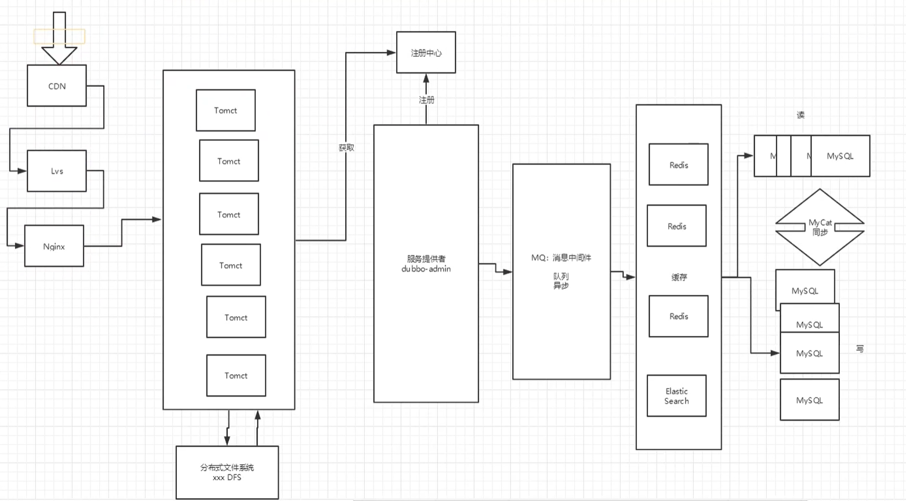
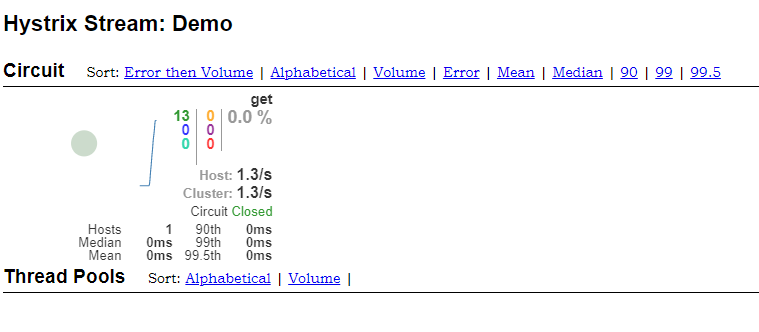

# 聊聊微服务

## 引言

原来的架构是，所有的服务模块都在一个项目里，并且所有种类的服务都运行在同一个服务器上；当用户数量多时，单个服务器不足以应付所有请求，这时候可以横向的添加服务器，这些服务器仍然运行所有种类的服务。这时候可能需要负载均衡来协调服务器资源。当用户数量继续增加时，有的服务模块可能占用很大的服务器资源，而另一些占用很少一部分服务器资源，这时候我们可以把各个服务模块拆分成不同项目，分别运行在不同服务器上，充分发挥每种服务的最大效率。这就是微服务的来源。

微服务化的核心就是将传统的一站式应用，根据业务拆分成一个一个的服务，彻底地去**解耦**，每一个微服务提供单个业务功能地服务，一个服务做一件事情，可以拥有自己独立地数据库。


开会，提供有价值的意见：要有**设计模式+微服务拆分**思想

## 需解决地核心问题

微服务架构面临的四个**核心问题**：

- 这么多服务，客户端该如何去访问？Api网关
- 这么多服务，服务之间如何进行通信？涉及防火墙和安全性问题
- 这么多服务，如何统一治理服务？统一的服务管理平台
- 服务挂了，怎么办？熔断，降级

## 解决方案

​    springcloud，是一套生态，就是来解决以上分布式架构的4个问题的。

第一套：spring cloud netflix出来的一套解决方案如下：

- Api网关，zuul组件
- Feign -->httpClient --> http的通信方式，同步阻塞
- 服务注册与发现，Eureka
- 熔断机制，Hystrix

第二套：Apache Dubbo Zookeeper，不完善

-  Api网关：没有！ 要么找第三方组件，要么自己实现
-  Dubbo，Rpc通信框架
-  服务注册与发现：zookeeper
-  熔断：没有，借助了Hystrix

第三套：Spring Cloud Alibaba 一站式解决方案


目前，又提出了一种方案：

**服务网格**：下一代微服务标准，Server Mesh

代表解决方案：istio

## 常见面试问题


## 优缺点

### 优点

- 单一职责原则

- 每个服务足够内聚，足够小，能够聚焦一个指定的业务功能和业务需求
- 微服务是松耦合的，无论是在开发阶段还是部署阶段都是独立的
- 不同微服务能使用不同语言开发
- 易于第三方集成，允许用灵活的方式集成自动部署，通过持续集成工具，如jenkins，hudson，bamboo等
- **微服务只是业务逻辑的代码，不会和html，css或者其他界面混合**
- **每个微服务都有自己的存储能力，可以有自己的数据库，也可以有统一的数据库**

### 缺点

- 开发人员要处理分布式系统的复杂性
- 多服务运维难度，随着服务的增加，运维的压力变大
- 系统部署依赖
- 服务间的通信成本
- 数据一致性
- 系统集成测试
- 性能监控

# SpringCloud简介

## 功能

配置管理、服务发现、断路器、路由、微代理、时间总线、全局锁、决策竞选、分布式会话等。

## 与springboot的关系

- springboot可以离开springcloud独立使用，但是反过来不行。
- springboot专注于快速、方便的开发单个个体微服务，springcloud关注全局的服务治理框架

## Dubbo与SpringCloud技术选型

### 分布式+服务治理Dubbo

目前成熟的互联网架构：应用服务化拆分+消息中间件



### Dubbo与SpringCloud对比


**最大的区别就是，SpringCloud抛弃了Dubbo的RPC通信，采用的是基于http的REST方式**。

这两种通信方法各有优劣：RPC方式的服务调用性能更加高，但是REST比RPC更加灵活，服务提供方和调用方的依赖只依靠一纸契约，不存在代码级别的强依赖，这在强调快速演化的微服务环境下，显得更加合适。

springcloud作为spring的项目，能与其他spring项目完美融合。

Dubbo停更了五年左右，于2017年7月重启

# 实战

使用的是RestFul风格请求来实现服务的调用。

## 根目录的依赖

```xml
<dependencyManagement>
        <dependencies>
<!--            springcloud依赖-->
            <dependency>
                <groupId>org.springframework.cloud</groupId>
                <artifactId>spring-cloud-dependencies</artifactId>
                <version>Greenwich.SR1</version>
                <type>pom</type>
                <scope>import</scope>
            </dependency>
<!--springboot依赖-->
            <dependency>
                <groupId>org.springframework.boot</groupId>
                <artifactId>spring-boot-dependencies</artifactId>
                <version>2.1.4.RELEASE</version>
                <type>pom</type>
                <scope>import</scope>
            </dependency>
<!--            数据库-->
            <dependency>
                <groupId>mysql</groupId>
                <artifactId>mysql-connector-java</artifactId>
                <version>8.0.23</version>
            </dependency>
            <dependency>
                <groupId>com.alibaba</groupId>
                <artifactId>druid</artifactId>
                <version>1.2.5</version>
            </dependency>
<!--            springboot启动器-->
            <dependency>
                <groupId>org.mybatis.spring.boot</groupId>
                <artifactId>mybatis-spring-boot-starter</artifactId>
                <version>2.1.4</version>
            </dependency>
<!--            日志测试-->
            <dependency>
                <groupId>ch.qos.logback</groupId>
                <artifactId>logback-core</artifactId>
                <version>1.2.3</version>
            </dependency>
            <dependency>
                <groupId>junit</groupId>
                <artifactId>junit</artifactId>
                <version>4.13.2</version>
                <scope>test</scope>
            </dependency>
            <dependency>
                <groupId>org.projectlombok</groupId>
                <artifactId>lombok</artifactId>
                <version>1.18.18</version>
            </dependency>
        </dependencies>
    </dependencyManagement>
```

如果springboot和springcloud的版本太高，可能导致后面的ribbon功能找不到服务实例，需要寻找其他方式来解决这个问题。

另外springboot和springcloud的版本有对应关系，需要注意它俩的版本号。


注意<dependencyManagement>：在父工程中添加了这个标签，则那么在子模块中只需要<groupId>和<artifactId>即可,而不需要再添加版本号。

与dependencies区别：

- Dependencies相对于dependencyManagement，所有生命在dependencies里的依赖都会自动引入，并默认被所有的子项目继承。
- dependencyManagement里只是声明依赖，并不自动实现引入，因此子项目需要显示的声明需要用的依赖。如果不在子项目中声明依赖，是不会从父项目中继承下来的；只有在子项目中写了该依赖项，并且没有指定具体版本，才会从父项目中继承该项，并且version和scope都读取自父pom;另外如果子项目中指定了版本号，那么会使用子项目中指定的jar版本。

```
<type>pom</type><scope>import</scope>`,解释一下：type标签的默认值是jar，代表我们依赖导入的是一个jar包，现在我们设置成了pom，说明导入的是一个父模块，后面的scope标签中的值import代表把父模块中的jar包导入进来，不过需要注意的是`<type>pom</type><scope>import</scope>`,这种方式只能用在`<dependencyManagement></dependencyManagement>
```

## 模块一：springcloud-01-api

这个子模块只需要提供实体类就行，并且实体类需要实现Serializable，即需要序列化，这样才能才提供者和消费之之间的网络中间传输

```java
@Data
@NoArgsConstructor
@Accessors(chain = true)  //链式写法
public class Dept implements Serializable { //实体类要序列化，以方便再网络中传输对象。
    private Long deptno;
    private String dname;
    private String db_source;

    public Dept(String dname) {
        this.dname = dname;
    }
}
```

## 模块二：springcloud-provider-dept-8001

8001是端口号，这个模块需要导入模块一的依赖,这样就能使用模块一的实体类了。

```xml
        <dependency>
            <groupId>com.kuang</groupId>
            <artifactId>springcloud-01-api</artifactId>
            <version>0.0.1-SNAPSHOT</version>
        </dependency>
```

除此之外，还需要配置数据、网络和测试等相关依赖。

配置文件，mapper层，service层，controller层。。。。。。

这个模块和之前我们写的非微服务形式的网站时过程和内容几乎**一模一样**，写好这个模块后，通过浏览器我们就能访问数据库中的内容。

这个模块里的Controller需要是RestController，即请求返回的是数据，而不是页面。

## 模块三：springcloud-consumer-dept-80

实际上，通过模块二我们就能访问底层的数据了。但是，模块三这一层，才是我们用户真正访问数据底层的入口。相较于不适用springcloud的架构，我们实际上是在访问浏览入口时多加了一层

这个模块同样要导入模块一的依赖。但是它是通过模块一的服务来操作数据库，所以并不需要数据库相关的依赖，只需要网络相关的依赖。

```java
@RestController
public class DeptConsumerController {
    //理解：消费之，不应该有service层
    //RestTemplate  供我们直接调用就可以了，注册到Spring中
    //(url,实体：map，Class<T> responseType)
    @Autowired
    private RestTemplate restTemplate;
    private String URL = "http://localhost:8001";

    @RequestMapping("/consumer/dept/get/{id}")
    public Dept get(@PathVariable("id") Long id){
        return restTemplate.getForObject(URL+"/dept/get/"+id,Dept.class);
    }

    @RequestMapping("/consumer/dept/add")
    public boolean add(Dept dept){
        return restTemplate.postForObject(URL+"/dept/add/",dept,boolean.class);
    }
    @RequestMapping("/consumer/dept/list")
    public List<Dept> list(){
        return restTemplate.postForObject(URL+"/dept/list",null,List.class);
    }
}
```

RestTemplate是spring提供的一个请求模板，通过它我们可以向模块二的发送请求。模块二中"/dept/get/"请求使用的是get方法，所以这里使用getForObject来请求。通过这个API，我们可以很方便的识别出请求方法，请求地址，附带参数和返回类型等信息。

## 运行

先运行模块二的主启动类，然后运行模块三的，之后再浏览器输入访问模块三的请求，就能得到返回数据。

## 模块四：springcloud-eureka-7001

这个模块是一个运行Eureka服务端的子模块。再之前的步骤中，模块三访问模块二的请求是通过URL来写死的，我们需要使用Eureka这个中间商来进一步解耦这两个模块。

**Eureka**：

- 是一个基于REST的服务，用于定位服务，以实现云端中间层服务发现和故障转移，类似于DUbbo的注册中心,比如Zookeeper
- 采用C-S的架构设计，作为服务注册中心
- 使用心跳包来验证服务是否还活着


导入Eureka服务端依赖

```xml
        <dependency>
            <groupId>org.springframework.cloud</groupId>
            <artifactId>spring-cloud-starter-netflix-eureka-server</artifactId>
            <version>2.0.4.RELEASE</version>
        </dependency>
```

配置文件：

```yaml
server:
  port: 7001

#Eureka
eureka:
  instance:
    hostname: localhost #Eureka服务端的实例名称
  client:
    register-with-eureka: false  #表示是否向eureka注册中心注册自己
    fetch-registry: false  #表示自己为注册中心
    service-url:  #可以视为监控页面
      defaultZone: http://${eureka.instance.hostname}:${server.port}/eureka/

```

然后在这个模块的主启动类上添加一个@EnableEurekaServer注解来开启Eureka服务器功能即可。

### 整合前面的模块

需要把模块二注册到Eureka服务器中。

导入依赖

```xml
        <!--        Eureka-->
        <dependency>
            <groupId>org.springframework.cloud</groupId>
            <artifactId>spring-cloud-starter-netflix-eureka-client</artifactId>
            <version>2.0.4.RELEASE</version>
        </dependency>
        <!--        actuator 完善监控信息-->
        <dependency>
            <groupId>org.springframework.boot</groupId>
            <artifactId>spring-boot-starter-actuator</artifactId>
        </dependency>
```

添加配置

```yaml
#Eureka配置, 服务注册到哪
eureka:
  client:
    service-url:
      defaultZone: http://localhost:7001/eureka/
  instance:
    instance-id: springcloud-provider-dept8001   #修改描述信息
#info,使用actuator依赖来输入更多详细信息
info:
  app.name: kuangshen-springcloud
  company.name: self.company
```

在其主启动类上添加@EnableEurekaClient 注解，即可。

另外，可以添加一个服务发现功能，用于多个人协同开发，别人可以通过这个功能轻易查看你开发的服务的相关信息：

```java
    @Autowired
    private DiscoveryClient client;
//注册进来的微服务，获取一些消息
    @GetMapping("/dept/discovery")
    public Object discovery(){
        List<String> services = client.getServices();
        System.out.println("Discovery services:"+services);
        List<ServiceInstance> instances = client.getInstances("SPRINGCLOUD-PROVIDER-DEPT");
        for (ServiceInstance instance : instances) {
            System.out.println(
                    instance.getHost()+"\n"+
                    instance.getPort()+"\n"+
                    instance.getUri()+"\n"+
                    instance.getServiceId()
            );
        }
        return this.client;
    }
```

上面的代码是卸载服务提供者的controller层的，访问接口的时候，就会打印所有服务的相关信息。

还需要在主启动类上添加一个注解：

```java
@EnableDiscoveryClient  //实现DiscoveryClient功能，controller中的功能
```


### Eureka集群

如果只有一个Eureka的话，那么倘若这个eureka挂了，那么整个系统就无法工作了，消费者就找不到服务提供者提供的服务，为了解决这个问题，我们需要做Eureka集群。

首先，为了模拟真实的开发集群情况，我们先自定义几个域名，方便后面的演示。我们需要开启三个Eureka的集群，所以需要配置三个域名，一一对应。


然后，新建另外两个Eureka子模块springcloud-eureka-7002和springcloud-eureka-7003，然后在配置文件修改对应端口号


以springcloud-eureka-7001模块为例，需要修改其配置文件的域名和关联到其他两个模块的eureka:

```yaml
server:
  port: 7001

#Eureka
eureka:
  instance:
    hostname: eureka7001.com #Eureka服务端的实例名称
  client:
    register-with-eureka: false  #表示是否向eureka注册中心注册自己
    fetch-registry: false  #表示自己为注册中心
    service-url:  #可以视为监控页面
      defaultZone: http://eureka7002.com:7002/eureka/,http://eureka7003.com:7003/eureka/
#      defaultZone: http://${eureka.instance.hostname}:${server.port}/eureka/

```

注意，**不用关联自己**，因为spring会自动完成这步操作。

关联到其他两个eureka后，就会在监控页面出现如下两条信息，这样就表示关联成功。


最后，服务提供者需要同时向三个eureka注册信息，通过修改配置即可达成目标：

```yaml
eureka:
  client:
    service-url:
      defaultZone: http://eureka7002.com:7002/eureka/,http://eureka7001.com:7001/eureka/,http://eureka7003.com:7003/eureka/
```

启动三个eureka，然后再启动服务提供者后，可以看到服务已注册到三个eureka中了。

## CAP原则

### 概述

redis、mongdb 等遵循CAP原则，数据库遵循ACID原则。

zookeeper，Eureka也遵循CAP原则。

CAP原则：

- C  (Consistency)  强一致性
- A  (Availability)  可用性
- P  (Partition tolerance)  分区容错性

**CAP核心**：

- 一个分布式系统不可能同时很好的满足一致性，可用性和分区容错性这三个需求，**最多只能同时满足其中两个要求原则**
- 根据CAP原理，将NoSQL分成了满足CP原则，CP原则和AP原则三大类：
  - CA：单点集群，满足一致性，可用性，通常可扩展性较差
  - CP：通常性能不是特别高
  - AP：通常可能对一致性要求低

## zookeeper和Eureka对比

**zookeeper满足的是CP**

​        满足一致性和分区容错性。服务注册功能对一致性的要求要高于可用性。但是当master节点因为网络故障与其他节点失去联系时，剩余的节点会重新进行leader选举。问题在于，选举的时间太长，通常是30~120S，并且选举期间整个zk集群是不可用的，这就导致再选举期间注册服务瘫痪。在云部署环境下，因为网络问题使得zk集群时区master节点是较大概率会发生的事件，虽然服务最终能够恢复，但是经历的时间太久是不可容忍的

**Eureka满足的是AP**

​        满足可用性和分区一致性。Eureka看明白了zookeeper这点不足之处。**Eureka各个节点都是平等的**，当一个节点挂掉之后，剩余节点不用进行复杂的选举过程，依然可以提供注册和查询服务。Eureka的客户端在向某个Eureka服务端注册时，如果发现连接失败，则会自动切换到其他节点，只要有一台Eureka还在，就能够保证注册服务的可用性，只不过查到的信息可能不是最新的。除此之外，Eureka还有一种自我保护机制，如果在15分钟内超过85%的节点都没有正常的心跳，那么Eureka就人为客户端与注册中心出现了网络故障，此时会出现下面几种情况：

1. Eureka不再从注册中心中移除长时间没有收到心跳而应该过期的服务，即等待网络恢复，从而使服务重新生效。
2. Eureka仍然能接受新服务的注册和查询请求，但不会同步到其他节点
3. 当网络稳定时，当前实例新的注册信息会被同步到其他节点中。


**因此，Eureka可以很好的应对因网络故障导致部分节点失去联系的情况，而不像zookeeper那样使整个注册服务瘫痪。**


## Ribbon

- Spring Cloud Ribbon时基于Netflix Ribbon实现的一套**客户端负载均衡的工具**
- 通过Spring Cloud的封装，可以让我们轻松地将面向服务的REST模版请求自动转换成客户端负载均衡的服务调用
- Ribbon的客户端组件提供一系列完整的配置项如：连接超时、重试等等。
- 只需要在配置文件中列出LoadBalancer（简称LB，负载均衡）后面的所有机器，Ribbon来回自动帮助你基于某种规则去连接这些机器。我们也可以很容易使用Ribbon实现自定义的负载均衡算法。

常见的负载均衡软件有：Ngnix，Lvs(Linux虚拟机服务器)

负载均衡简单分类：

- 集中式：就像Ngnix，反向代理，请求先到它这里，然后它再进行负载均衡。
- 进程式：比如Ribbon，先通过Eureka去服务注册中心拿到所有服务，然后得到信息后在本地进行负载均衡操作。

所以Ribbon的负载均衡是在消费者端进行。

Ribbon需要配置到服务消费者模块：springcloud-consumer-dept-80

给这个模块添加Eureka和Ribbon依赖：

```xml
<!--        Eureka-->
        <dependency>
            <groupId>org.springframework.cloud</groupId>
            <artifactId>spring-cloud-starter-netflix-eureka-client</artifactId>
            <version>2.0.4.RELEASE</version>
        </dependency>
```

这个Eureka依赖包已经包含了ribbon相关依赖，不用再重新导入ribbon的包了。

配置Eureka信息：

```yaml
#Eureka配置
eureka:
  client:
    register-with-eureka: false  #不向Eureka注册自己
    service-url:
      defaultZone: http://eureka7002.com:7002/eureka/,http://eureka7001.com:7001/eureka/,http://eureka7003.com:7003/eureka/
```

主启动类添加注解，开启Eureka功能

```java
@EnableEurekaClient
```

然后在配置类中生成RestTemplate对象的方法上添加注解，表示开启Ribbon负载均衡：

```java
//配置负载均衡
    @LoadBalanced  //开启Ribbon的负载均衡
    @Bean
    public RestTemplate getRestTemplate(){
        return new RestTemplate();
    }
```

注意spring-cloud-starter-eureka-server和spring-cloud-starter-netflix-eureka-server的区别：

spring-cloud-starter-eureka-server在springboot2.x以上被废弃了，取而代之的是spring-cloud-starter-netflix-eureka-server，所以当使用springboot2.x以上的版本的时候，尽量使用**spring-cloud-starter-netflix-xxxx**的版本。

另外，在spring-cloud-starter-netflix-eureka-server/client中，已经包含了spring-cloud-starter-netflix-ribbon和ribbon-eureka，不用再重新导入这两个包了

### 多服务提供者测试

拷贝模块二，新增模块springcloud-provider-dept-8002和springcloud-provider-dept-8003.

然后修改这两个模块的依赖和配置之后，启动所有的工程。


可以看到Status栏出现了三个模块。

注意，这三个模块的spring.application.name必须一致，才能表示这三个服务是同一种服务，然后可以消费之就可以由ribbon负载均衡来选择这三个服务之一。

### 自定义负载均衡规则

需要在消费者端进行。

需要在主启动类包外进行配置，防止主启动类上的自动扫描注解把我们配置的负载均衡策略给注册到spring中，这样的话会导致所有的ribbon client的负载均衡配置都变成了我们配置的策略。

主启动类的包是com.kuang.springcloud，按照上面的说法，我们建立一个myrule包：


KuangRule类是一个配置类，用法返回我们配置的规则bean：

```java
@Configuration
public class KuangRule {
    @Bean
    public KuangRandomRule getKuangRandomRule(){
        return new KuangRandomRule();
    }
}
```

KuangRandomRule类参照源码中已有的负载均衡规则RandomRule修改而来：

```java
//自定义负载均衡策略，下面的代码是参照RandomRule类的实现过程，直接拷贝过来改的。
public class KuangRandomRule extends AbstractLoadBalancerRule {

    private int count=0;
    private int index=0;
    public Server choose(ILoadBalancer lb, Object key) {
        if (lb == null) {
            return null;
        } else {
            Server server = null;

            while(server == null) {
                if (Thread.interrupted()) {
                    return null;
                }

                List<Server> upList = lb.getReachableServers();
                List<Server> allList = lb.getAllServers();
                int serverCount = allList.size();
                if (serverCount == 0) {
                    return null;
                }

//                int index = this.chooseRandomInt(serverCount);
                //============================自定义代码==================
                if(count>=5){//依次访问每个服务五次
                    count=0;
                    index=(index+1)%serverCount;
                }
                else
                    count++;
                //======================================================

                server = (Server)upList.get(index);
                if (server == null) {
                    Thread.yield();
                } else {
                    if (server.isAlive()) {
                        return server;
                    }

                    server = null;
                    Thread.yield();
                }
            }

            return server;
        }
    }

    protected int chooseRandomInt(int serverCount) {
        return ThreadLocalRandom.current().nextInt(serverCount);
    }

    public Server choose(Object key) {
        return this.choose(this.getLoadBalancer(), key);
    }

    public void initWithNiwsConfig(IClientConfig clientConfig) {
    }

}
```

最后在主启动类上增加注解@RibbonClient

```java
@RibbonClient(name = "SPRINGCLOUD-PROVIDER-DEPT",configuration = KuangRule.class)
```

name是三个服务提供者共同的服务名称，configuration是上面写的配置类。

启动测试即可！

## Feign

Feign旨在使编写java Http客户端变得更容易

前面在使用RIbbon+RestTemplate，使用了服务名称来进行服务调用。但在实际开发中，由于对服务依赖的调用可能不止一处，往往一个接口会被多处调用。所以通常都会针对一个微服务自行封装一些客户端类来包装这些依赖服务的调用。**在Feign的实现下，我们只需要创建一个接口并使用注解的方式来配置它，即可完成对服务提供方的接口绑定，简化了Ribbon时，自动封装服务调用客户端的开发量**。

**Feign集成了Ribbon**

- 利用Ribbon维护了服务列表信息，并且通过轮询实现了客户端的负载均衡，而与Ribbon不同的是，通过Feign只需要定义服务绑定接口且以声明式的方法，优雅而且简洁地实现了服务调用。

## Hystrix

分布式系统面临的问题

复杂分布式体系结构中的应用程序有数十个依赖关系，每个依赖关系在某些时候将不可避免地失败！从而引起**服务雪崩**

### 服务雪崩

服务A调用服务B，服务B调用服务C，服务C又调用其他服务，这就是所谓地“扇出”，服务扇出地链路上某个微服务比如B的调用响应时间过长或者不可用，对服务A来说就会占用越来越多的系统资源，进而引起系统崩溃，所谓的“雪崩效应”，**级联故障**

### 什么是HyStrix

是一个用于处理分布式系统的延迟和容错的开源库，比如超时，异常等，Hystrix能够保证在一个依赖出问题时，不会导致整体服务整体失败，避免级联故障，以提高分布式系统的弹性。“断路器”当某个服务单元发生故障之后，通过断路器的故障监控（类似熔断保险丝），**向调用方返回一个服务预期的，可处理的备选响应(FallBack),而不是长时间等待或者抛出调用方法无法处理的异常，这样就可以保证了服务调用方的线程不会被长时间占用，从而避免故障在分布式系统中的蔓延，乃至雪崩。**

能干吗？

1. **服务降级**
2. **服务限流**
3. **服务熔断**：**熔断故障节点的服务调用，快速返回错误的响应信息**，缺省值5秒内调用20次调用失败就触发熔断，注解是**@HystrixCommand**
4. 接近实时的监控
5. 。。。

### 服务熔断

HyStrix需要整合到服务提供者模块中，新建服务提供者模块：springcloud-provider-dept-hystrix-8001

导入依赖：

```xml
<dependency>
    <groupId>org.springframework.cloud</groupId>
    <artifactId>spring-cloud-starter-netflix-hystrix</artifactId>
    <version>2.0.4.RELEASE</version>
</dependency>
```

在需要熔断的方法上添加注解@HystrixCommand：

```java
@HystrixCommand(fallbackMethod = "hystrixGet")
    @GetMapping("/dept/get/{id}")
    public Dept get(@PathVariable("id") Long id){
        Dept dept = deptService.queryDeptById(id);

        if(dept==null){
            throw new RuntimeException("id=>"+id+",不存在该用户，或者信息无法查到");
        }

        return dept;
    }

    //备选方法
    public Dept hystrixGet(@PathVariable("id") Long id){
        return new Dept()
                .setDeptno(id)
                .setDname("id=>"+id+"没有对应的信息，null--@Hystrix")
                .setDb_source("There is not database");
    }
```

这样在get方法中有异常时，就自动调用hystrixGet方法替代它。

最后在主启动类上开启熔断器@EnableCircuitBreaker：

```java
//启动类
@SpringBootApplication
@EnableEurekaClient  //在服务启动后，自动注册到Eureka中。
@EnableDiscoveryClient  //实现DiscoveryClient功能，controller中的功能
@EnableCircuitBreaker  //添加对熔断的支持,断路器
public class DeptProviderHystrix_8001 {
    public static void main(String[] args) {
        SpringApplication.run(DeptProviderHystrix_8001.class,args);
    }
}
```

### 服务降级

某个时间段，某个服务A有非常多的请求处理不过来，这个时候就把闲着的当前不重要的服务B让出来，从而让服务A占用更多的系统资源，更好地处理这些请求，等到高峰时间段过去后，再允许访问服务B。这个过程就叫做**服务B被服务降级**

服务降级是在**客户端**处做。

在第一个模块中编写降级java代码，这里的是用于访问已关闭服务时，给客户端返回的信息。

```java
//降级
@Component
public class DeptClientServiceFallbackFactory implements FallbackFactory {
    public DeptClientService create(Throwable throwable) {
        return new DeptClientService() {
            public Dept queryById(Long id) {
                return new Dept()
                        .setDeptno(id)
                        .setDname("id=>"+id+"没有对应的信息，客户端提供了降级的信息，这个服务暂时访问不了")
                        .setDb_source("没有数据库");
            }

            public List<Dept> queryAll() {
                return null;
            }

            public boolean addDept(Dept dept) {
                return false;
            }
        };
    }
}
```

改写DeptClientService服务,添加了"fallbackFactory = DeptClientServiceFallbackFactory.class"

```java
@FeignClient(value = "springcloud-provider-dept", fallbackFactory = DeptClientServiceFallbackFactory.class)
public interface DeptClientService {
    @GetMapping("/dept/get/{id}")
    Dept queryById(@PathVariable("id") Long id);
    @GetMapping("/dept/list")
    List<Dept> queryAll();
    @PostMapping("/dept/add")
    boolean addDept(Dept dept);
}

```

DeptClientService是之前第一个模块中的用于连接消费者和服务提供者的中介代码：消费者使用函数名来访问，函数上面的路由信息和服务提供者的服务接口路由一致，从而达到消费者使用函数接口访问服务提供者服务的功能。

最后，消费者端开启降级功能（在springcloud-consumer-dept-feign模块上做）

```yaml
#开启服务降级
feign:
  hystrix:
    enabled: true
```

**服务熔断和降级对比**：

- 熔断：服务端、某个服务超时或者异常时引起熔断，功能类似保险丝，是被动的，
- 降级：消费者端、从整体网站请求负载考虑，当某个服务关闭之后，服务将不再被调用，此时在消费者端，我们准备一个FallbackFactory，返回一个默认的值。是主动的。

### Dashboard

dashboard用于在监控服务端服务流量的情况

新建项目springcloud-consumer-hystrix-dashboard

导入模块二的依赖并且导入新依赖Hystrix：

```xml
<!--        Hystrix依赖-->
        <dependency>
            <groupId>org.springframework.cloud</groupId>
            <artifactId>spring-cloud-starter-netflix-hystrix</artifactId>
            <version>2.0.4.RELEASE</version>
        </dependency>
        <dependency>
            <groupId>org.springframework.cloud</groupId>
            <artifactId>spring-cloud-starter-netflix-hystrix-dashboard</artifactId>
            <version>2.0.4.RELEASE</version>
        </dependency>
```

配置文件：

```yaml
server:
  port: 9001
```

主启动类上开启监控功能即可

```java
@SpringBootApplication
@EnableHystrixDashboard  //开启Dashboard功能
public class DeptConsumerDashboard_9001 {
    public static void main(String[] args) {
        SpringApplication.run(DeptConsumerDashboard_9001.class,args);
    }
}
```

要保证服务提供者有actuator依赖,不谈监控不到。

```xml
        <dependency>
            <groupId>org.springframework.boot</groupId>
            <artifactId>spring-boot-starter-actuator</artifactId>
        </dependency>
```

通过http://localhost:9001/hystrix可以进入监控页面。

进入的页面如下所示：


注意：服务提供者必须要有熔断功能，即要有**@EnableCircuitBreaker**，并且只能监控**@HystrixCommand**标注的方法接口，所以我们选择的服务开启是springcloud-provider-dept-hystrix-8001服务。

在选择的服务提供者中添加一个Serverlet的bean：

```java
//HystrixDashboard功能
    //增加一个Servlet
    @Bean
    public ServletRegistrationBean HystrixMetricsStreamServlet(){
        ServletRegistrationBean registrationBean = new ServletRegistrationBean(new HystrixMetricsStreamServlet());
        registrationBean.addUrlMappings("/actuator/hystrix.stream");
        return registrationBean;
    }
```

这样通过访问服务提供者的端口是8001，这样通过访问http://localhost:8001/actuator/hystrix.stream就可以看到ping此服务的信息。我们的Hystrix Dashboard页面监控的就是这个网址：


点击 “Monitor Stream”之后，就可以看到监控页面信息了：



访问服务消费者之后，就会在上面的页面留下信息，上图所示的13就是访问了13次。

**注意：如果上述页面无显示或者访问http://localhost:8001/actuator/hystrix.stream后出现的一直都是“ping”，那么可以先访问下消费者，之后再看是否出现信息。**

## Zuul

路由网关zuul能干吗？

- 路由
- 过滤

实现外部访问统一入口，过滤功能则负责对请求的处理过程进行干预，是实现请求校验，服务聚合等功能的基础。**需要将zuul自身注册为Eureka服务治理下的应用**，同时从Eureka中获取其他微服务的消息，也就是以后访问问服务都是通过Zuul跳转后获得的。

新建子模块springcloud-zuul-9527

导入dashboard模块的所有依赖和下面zuul依赖：

```xml
<!--        Zuul-->
        <dependency>
            <groupId>org.springframework.cloud</groupId>
            <artifactId>spring-cloud-starter-netflix-zuul</artifactId>
            <version>2.0.4.RELEASE</version>
        </dependency>
```

配置application.yaml

```yaml
server:
  port: 9527
spring:
  application:
    name: springcloud-zuul
eureka:
  client:
    service-url:
      defaultZone: http://eureka7002.com:7002/eureka/,http://eureka7001.com:7001/eureka/,http://eureka7003.com:7003/eureka/
  instance:
    instance-id: zuul9527
    prefer-ip-address: true
info:
  app.name: kuang-springcloud
  company.name: www.kuangstudy.com
zuul:
  routes:
    mydept.serviceId: springcloud-provider-dept #服务名
    mydept.path: /mydept/**  #使用这个代替服务名，这样在访问路劲中就可以不再使用服务名了
#  ignored-services: springcloud-provider-dept  #上面两个都可以访问，这个就禁止使用服务名访问了, 一般使用通配符 “*”
#  prefix: /kuang   #设置访问路径公共前缀

```

zuul是作为一个服务注册到Eureka中的，所以其他的配置和普通的服务配置一样。主要是zuul配置

主启动类开启zuul功能

```java
@SpringBootApplication
@EnableZuulProxy
public class ZuulApplication_9527 {
    public static void main(String[] args) {
        SpringApplication.run(ZuulApplication_9527.class,args);
    }
}
```


原本访问服务提供者的路径是：http://localhost:8001/dept/get/1

通过配置zuul之后可以通过http://www.kuangstudy.com:9527/springcloud-provider-dept//dept/get/1和http://www.kuangstudy.com:9527/mydept//dept/get/1，但是配置了"ignored-services"的话，就不能用前一个路径访问。通过zuul，屏蔽了多个服务提供者不同域名或者端口导致的路径多样的问题，通过统一的**zuul域名+服务名**即可以访问服务。

注意：www.kuangstudy.com是我们配置在host文件中的，就是127.0.0.1或者localhost

## Config

配置文件多了，每个子模块的配置都分散到各自模块，如果要统一进行配置的话不太方便，我们可以把配置文件远程托管到github或者码云上，然后通过SpringCloud Config来读取配置。这样的话只需要修改github上的配置文件内容，就可以远程修改服务的配置。

分为Config-server和Config-Client, Config-server负责从github上读取配置内容，再把内容提供为Config-Client.


我们再自己的github账户上新建一个仓库springcloud-config.git,里面就放一个配置文件application.yaml:

```yaml
spring:
  profiles:
    active: dev

---

spring:
  profiles: dev
  application:
    name: springcloud-config-dev


---

spring:
  profiles: test
  application:
    name: springcloud-config-test
```


### Config Server

新建子模块springcloud-config-server-3344 作为Config Server

导入依赖：

```xml
<!--        config-server-->
        <dependency>
            <groupId>org.springframework.cloud</groupId>
            <artifactId>spring-cloud-config-server</artifactId>
            <version>2.0.4.RELEASE</version>
        </dependency>
		<dependency>
            <groupId>org.springframework.boot</groupId>
            <artifactId>spring-boot-starter-web</artifactId>
        </dependency>
```

编写配置文件：

```yaml
server:
  port: 3344

spring:
  application:
    name: springcloud-config-server
  #连接远程仓库
  cloud:
    config:
      server:
        git:
          uri: https://github.com/PanZzhou/springcloud-config.git  #https,而非git

```

其中uri后的链接就是我们配置仓库springcloud-config.git的https链接，注意不能是git

在主启动类上开启开启远程配置

```java
@EnableConfigServer  //开启远程配置
```

测试：

访问http://localhost:3344/application-dev.yaml路径


读取到配置！

- localhost:3344 是这个服务的主机和端口号
- application是git上的对应配置文件的名称
- dev是这个配置文件中配置的环境名称profiles

### Config Client

Config Server从git上读取到配置，Config Client然后再Config Server处读取到对应配置。

在git上新建一个config-client.yaml文件:

```yaml
spring:
  profiles:
    active: dev
---
server:
  port: 8201

#spring配置
spring:
  profiles: dev
  application:
    name: springcloud-provider-dept  

#Eureka配置, 服务注册到哪
eureka:
  client:
    service-url:
      defaultZone: http://eureka7001.com:7001/eureka/
      
---
server:
  port: 8202

#spring配置
spring:
  profiles: test
  application:
    name: springcloud-provider-dept  

#Eureka配置, 服务注册到哪
eureka:
  client:
    service-url:
      defaultZone: http://eureka7001.com:7001/eureka/
```

上面的配置文件配置了两套环境，后面内容是演示Config Client 如何拿到上述配置。

新建子模块 springcloud-config-client

导入依赖：

```xml
        <dependency>
            <groupId>org.springframework.cloud</groupId>
            <artifactId>spring-cloud-starter-config</artifactId>
            <version>2.0.4.RELEASE</version>
        </dependency>

        <dependency>
            <groupId>org.springframework.boot</groupId>
            <artifactId>spring-boot-starter-web</artifactId>
        </dependency>
```

tips：application.yaml和bootstrap.yaml两种配置文件命名方式，前者是应用级配置，后者是系统级配置文件。

配置系统级配置bootstrap.yaml:

```yaml
#系统级别的配置
spring:
  cloud:
    config:
      name: config-client  #需要从git上读取的资源名称，不要后缀
      uri: http://localhost:3344  #config server的链接地址
      profile: test
      label: master
```

这里面配置了Config Server访问路径，和要读取的配置文件和环境（这些信息Server已经事先从git上拿到了，所以直接访问Server拿配置信息）。

配置应用级配置文件application.yaml

```yaml
#用户级别的配置
spring:
  application:
    name: springcloud-config-client-3355
```

这里只是配置了服务的名称。

我们这里选择使用controller来访问拿到的配置信息。写一个controller：

```java
@RestController
public class ConfigClientController {
    @Value("${spring.application.name}")
    private String applicationName;
    @Value("${eureka.client.service-url.defaultZone:\n}")
    private String eurekaServer;
    @Value("${server.port}")
    private String port;

    @RequestMapping("/config")
    public String getConfig(){
        return "applicationName: "+applicationName +
                "  eurekaServer: "+eurekaServer +
                "  port: " + port;
    }
}
```

@Value用于把配置的值绑定到属性上，如server.port配置的值被绑定到port属性上

我们在上面的application.yaml和bootstrap.yaml都没有配置端口号，但是我们在git上已经配置了端口号8201和8202，并且bootstrap.yaml中配置了使用test环境的配置，所以Client拿到的是test下的端口号8202，所以我们访问http://localhost:8202/config就可以访问这个getConfig的controller。结果为：


可以看到，我们已经获取到git上的配置文件的配置信息！

### 把eureka和服务提供者整合上config

分别建立子模块springcloud-provider-dept-config-8001和springcloud-eureka-config-7001，让他们的配置从git上读取，这两个子模块分别克隆自springcloud-provider-dept-hystrix-8001和springcloud-eureka-7001子模块。

在git远端添加eureka和dept的配置文件

**config-dept.yaml**

```yaml
spring:
  profiles:
    active: dev
---

server:
  port: 8001

#mybatis配置
mybatis:
  type-aliases-package: com.kuang.springcloud.pojo
  mapper-locations: classpath:mybatis/mapper/*.xml
  config-location: classpath:mybatis/mybatis.xml

#spring配置
spring:
  profiles: dev
  application:
    name: springcloud-config-dept  #三个服务名称一致是前提
  datasource:
    type: com.alibaba.druid.pool.DruidDataSource  #数据源
    driver-class-name: com.mysql.cj.jdbc.Driver  #驱动
    url: jdbc:mysql://localhost:3306/sc03?useUnicode=true&characterEncoding=utf-8&useSSL=true&serverTimeZone=UTC
    username: root
    password: 123456

#Eureka配置, 服务注册到哪
eureka:
  client:
    service-url:
      defaultZone: http://eureka7002.com:7002/eureka/,http://eureka7001.com:7001/eureka/,http://eureka7003.com:7003/eureka/
  instance:
    instance-id: springcloud-provider-dept8001   #修改描述信息
#info,使用actuator依赖来输入更多详细信息
info:
  app.name: kuangshen-springcloud
  company.name: self.company
  

---

server:
  port: 8001

#mybatis配置
mybatis:
  type-aliases-package: com.kuang.springcloud.pojo
  mapper-locations: classpath:mybatis/mapper/*.xml
  config-location: classpath:mybatis/mybatis.xml

#spring配置
spring:
  profiles: test
  application:
    name: springcloud-config-dept  #三个服务名称一致是前提
  datasource:
    type: com.alibaba.druid.pool.DruidDataSource  #数据源
    driver-class-name: com.mysql.cj.jdbc.Driver  #驱动
    url: jdbc:mysql://localhost:3306/sc02?useUnicode=true&characterEncoding=utf-8&useSSL=true&serverTimeZone=UTC
    username: root
    password: 123456

#Eureka配置, 服务注册到哪
eureka:
  client:
    service-url:
      defaultZone: http://eureka7002.com:7002/eureka/,http://eureka7001.com:7001/eureka/,http://eureka7003.com:7003/eureka/
  instance:
    instance-id: springcloud-provider-dept8001   #修改描述信息
#info,使用actuator依赖来输入更多详细信息
info:
  app.name: kuangshen-springcloud
  company.name: self.company
```

config-eureka.yaml:

```yaml
```

本地的这两个子模块添加bootstrap.yaml配置文件:

```yaml
spring:
  cloud:
    config:
      uri: http://localhost:3344
      profile: dev
      label: master
      name: config-dept  #eureka配成config-eureka，表示要使用的git上的配置文件名。
```

开启Config Server、eureka、dept对应的子模块进行测试。

tips：

- github上可以在线修改配置文件！
- 修改了配置文件之后，Config Server得到的数据就已经改变，但是Config Client的配置信息还未更新。需要热部署重新配置信息，通过点击build-》build module(对应模块名字)即可完成部署，从而使配置生效！